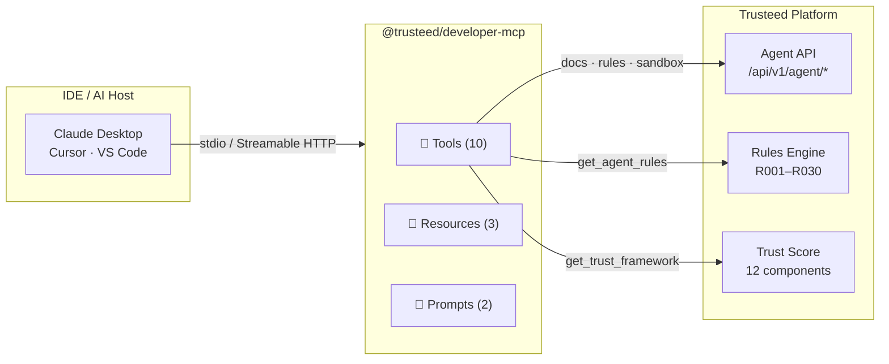
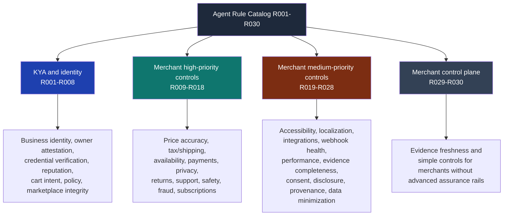
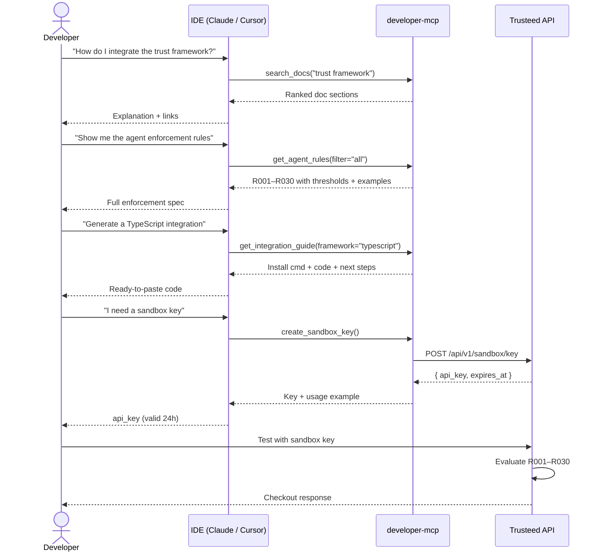

[English](README.md) | [Español](README.es.md) | [Français](README.fr.md) | [**Deutsch**](README.de.md)

# @trusteed/developer-mcp

**Integrationsassistent für die händlerseitigen Agent-Policy-, Trust-Scoring- und Checkout-Enforcement-APIs von [Trusteed](https://www.trusteed.xyz).**

Dies ist ein öffentlicher, schreibgeschützter MCP-Server für **Developer Enablement**: Er beantwortet Fragen, liefert die Händler-Agent-Regeln (R001–R030), zeigt die OpenAPI-Fragmente, generiert Integrationscode für die gängigsten Frameworks und stellt kurzlebige Sandbox-Keys aus. Er ist dafür gedacht, neben Ihrer IDE zu laufen, während Sie Ihre Integration mit Trusteed entwickeln.

Er ist **kein** Checkout-Runtime. Das Enforcement in Produktion erfolgt über die Trusteed-API, die Händler-Plugins (Shopify, WooCommerce, PrestaShop, Odoo, Magento, Wix) und den signierten RuleSnapshot, den diese Plugins offline abrufen. Die Entscheidungen, die ein LLM aus den Antworten dieses MCP ableitet, sind dokumentarische Orientierungshilfe, keine Autorisierung.

Funktioniert mit Claude Desktop, Cursor, VS Code und jedem MCP-kompatiblen Host. Für die Dokumentations-Tools ist keine Authentifizierung erforderlich; `create_sandbox_key` ist pro IP ratenbegrenzt.

---

## Wann dieses MCP NICHT verwendet werden sollte

Dieser Server ist bewusst eng gefasst. Verwenden Sie ihn nicht für:

- **Autorisierungsentscheidungen in Produktion.** Die Ausgabe von `get_agent_rules` beschreibt, _wie_ R001–R030 funktionieren; sie _führt_ sie nicht aus. Rufen Sie für jede reale Freigabe-/Blockierungsentscheidung `POST /api/v1/rules/evaluate` auf (oder holen Sie den signierten RuleSnapshot für Offline-Enforcement ab).
- **Speichern oder Rotieren von Secrets.** Fügen Sie niemals langlebige API-Keys, Händler-Zugangsdaten oder Produktions-Tokens in Prompts ein, die dieses MCP erreichen. Die von `create_sandbox_key` zurückgegebenen Sandbox-Keys sind als Wegwerf-Keys konzipiert (24 h TTL); Ratenlimits werden serverseitig durchgesetzt.
- **Verarbeitung von PCI-, PII- oder Zahlungsdaten.** Die Tools liefern ausschließlich Dokumentation, Schemata und Konfigurationsmetadaten. Es fließen keine PAN-, PII- oder Bestelldaten über diesen Server.
- **Compliance-Bescheinigung.** LLM-generierte Erklärungen zum Trust-Framework oder zur Regel-Semantik sind rechtlich nicht bindend. Nutzen Sie für jede Compliance-, Audit- oder Rechtsprüfung die kanonischen Quellen (die [Seite zur Trust-Methodik](https://www.trusteed.xyz/trust/methodology), die [agent-policy.json](https://www.trusteed.xyz/.well-known/agent-policy.json), die OpenAPI-Spezifikation).
- **Programmatischen Zugriff mit hohem Volumen.** Der HTTP-Modus ist ratenbegrenzt (100 Anfragen / 15 Min. / IP). Spiegeln Sie für die Massen-Ingestion von Dokumentation die OpenAPI- und Markdown-Quellen direkt von der öffentlichen Website oder dem Repository.

Wenn Sie einen Server benötigen, der im Auftrag eines Agents Commerce-Aktionen _ausführt_ (Warenkörbe, Checkouts, Zahlungen), ist das ein separates Thema — Trusteed stellt dies über den pro Händler dokumentierten MCP-Server unter `trusteed.xyz/:storeSlug/mcp` sowie über die Händler-Plugins bereit. Dieses Paket wird sich nicht in diese Richtung entwickeln.

---

## Schnellstart

### npx (einmalige Ausführung)

```bash
npx @trusteed/developer-mcp
```

### Claude Desktop

Fügen Sie Folgendes zu `~/Library/Application Support/Claude/claude_desktop_config.json` hinzu:

```json
{
  "mcpServers": {
    "trusteed": {
      "command": "npx",
      "args": ["-y", "@trusteed/developer-mcp"]
    }
  }
}
```

### Cursor / VS Code

Fügen Sie Folgendes zu `.cursor/mcp.json` oder `.vscode/mcp.json` hinzu:

```json
{
  "servers": {
    "trusteed": {
      "command": "npx",
      "args": ["-y", "@trusteed/developer-mcp"]
    }
  }
}
```

### HTTP-Modus (remote / Multi-Client)

```bash
npx @trusteed/developer-mcp --http --port=3100
# POST http://localhost:3100/mcp
# Ratenlimit: 100 Anfragen / 15 Min. pro IP
```

---

## Architekturübersicht



---

## Tools

### `search_docs`

Durchsucht die Trusteed-Dokumentation nach Stichwort. Liefert nach Relevanz sortierte Ergebnisse aus dem Trust-Framework, der API-Referenz, den Protokollspezifikationen, den Integrationsleitfäden und dem Glossar.

| Parameter | Typ          | Erforderlich | Beschreibung                                                                    |
| --------- | ------------ | ------------ | ------------------------------------------------------------------------------------ |
| `query`   | string       | ✅           | Suchbegriffe (z. B. `"trust score"`, `"x402 protocol"`)                              |
| `section` | enum         | —            | Filter: `api` · `trust` · `protocols` · `integration` · `glossary` · `general`      |
| `limit`   | integer 1–20 | —            | Maximale Anzahl Ergebnisse (Standard: 5)                                              |

---

### `get_agent_rules`

Liefert die 30 Händler-Agent-Regeln (R001–R030) mit Tiers, konfigurierbaren Schwellenwerten, Auslösebedingungen und Beispielen. Die primäre Referenz zur Implementierung des Trusteed-Enforcement-Modells. Diese Regeln erfordern weder eIDAS noch QTSP, Visa Verifier oder zahlungsnetzwerkspezifische Nachweise, sofern ein Händler solche Nachweise nicht explizit anderweitig konfiguriert.

| Parameter | Typ    | Erforderlich | Beschreibung                                                                |
| --------- | ------ | ------------ | ---------------------------------------------------------------------------------- |
| `filter`  | enum   | —            | `all` · `tier1` · `tier2` · `needs_lookup` · `no_lookup` (Standard: `all`)         |
| `code`    | string | —            | Einzelne Regel nach Code, z. B. `R007`. Hat Vorrang vor `filter`.                  |

---

### `get_trust_framework`

Liefert die vollständige Methodik des Händler-Trust-Scorings: 12 gewichtete Komponenten, die veröffentlichte Ranking-Formel, Sichtbarkeitszustände des Händlers und Verifizierungsstufen.

Keine Parameter.

---

### `get_protocol_info`

Details zu den drei unterstützten agentischen Zahlungsprotokollen: ACP (Stripe/OpenAI), AP2 (Google), x402 (USDC-Stablecoin). Enthält den Zahlungsablauf, Sicherheitsmaßnahmen und Adapter-Kennungen.

| Parameter  | Typ    | Erforderlich | Beschreibung                                                                  |
| ---------- | ------ | ------------ | ------------------------------------------------------------------------------------ |
| `protocol` | string | —            | `ACP` · `AP2` · `x402`. Weglassen für einen direkten Vergleich aller drei.           |

---

### `get_openapi_schema`

Liefert das OpenAPI-3.0-Fragment für einen bestimmten Endpunkt der Agent API.

| Parameter  | Typ    | Erforderlich | Beschreibung                                                                                       |
| ---------- | ------ | ------------ | ---------------------------------------------------------------------------------------------------- |
| `resource` | string | ✅           | `search` · `products` · `compare` · `availability` · `cart` · `checkout` · `orders` · `merchants`   |

---

### `get_integration_guide`

Schritt-für-Schritt-Integrationsleitfaden mit funktionierendem Code für ein bestimmtes Framework.

| Parameter   | Typ    | Erforderlich | Beschreibung                                                                    |
| ----------- | ------ | ------------ | -------------------------------------------------------------------------------------- |
| `framework` | string | ✅           | `typescript` · `python` · `langchain` · `vercel-ai` · `openai-agents` · `curl`         |

---

### `create_sandbox_key`

Generiert einen temporären, 24 Stunden gültigen API-Key zum Testen ohne Registrierung. Ratenlimits werden serverseitig durchgesetzt.

Keine Parameter.

---

### `get_extension_manifest_schema`

Liefert das Schema des Trusteed-Extension-Manifests: erforderliche Felder, feldspezifische Einschränkungen mit entwicklerorientierten Hinweisen sowie den Signaturumschlag (JWS Compact Ed25519, RFC-8785-Kanonisierung, Entwickler- + Trusteed-Gegenzeichnung). Nur Dokumentation — verwenden Sie für die Laufzeitvalidierung den `@trusteed/sdk-extension`-Linter oder rufen Sie die kanonische Schema-URL ab.

Keine Parameter.

---

### `get_webhook_event_schema`

Liefert den Webhook-Zustellungsvertrag von Trusteed: Umschlagstruktur, kanonischer HMAC-SHA256-Basisstring `v1.{ts}.{nonce}.{METHOD}.{path}.{sha256_hex(body)}`, Retry-Zeitplan `[5s, 30s, 5min, 1h, 6h]` mit DLQ beim 6. Versuch, Circuit-Breaker-Semantik sowie Payload-Zusammenfassungen pro Ereignis.

| Parameter    | Typ    | Erforderlich | Beschreibung                                                                                                                                                                                                                                             |
| ------------ | ------ | ------------ | --------------------------------------------------------------------------------------------------------------------------------------------------------------------------------------------------------------------------------------------------------- |
| `event_type` | string | —            | Einzelnes Ereignis zur Detailausgabe. Eines von: `agent.first_seen`, `agent.identified`, `checkout.created`, `checkout.completed`, `checkout.cancelled`, `checkout.blocked`, `refund.issued`, `rule.triggered`. Weglassen für den vollständigen Umschlag + Signaturreferenz. |

---

### `get_extension_scopes`

Liefert den Katalog der `scopes_requested`-Enum-Werte mit Datenklassifizierung (öffentlich / operativ / sensibel / PII), PII-Kennzeichnung, minimaler Auswirkung auf `risk_category`, einem Beispielanwendungsfall und einem expliziten „Nicht dafür geeignet“-Anwendungsfall. Verankert das Prinzip des minimal tragfähigen Scopes: Extensions, die auf `customers:read:pii` zugreifen, erhalten eine manuelle Prüfung, eine hohe `risk_category` und eine langsamere Installationskonversion.

| Parameter | Typ    | Erforderlich | Beschreibung                                                                                                                                                                                                                                                                                                                                                          |
| --------- | ------ | ------------ | -------------------------------------------------------------------------------------------------------------------------------------------------------------------------------------------------------------------------------------------------------------------------------------------------------------------------------------------------------------------------- |
| `scope`   | string | —            | Einzelner Scope-Name zur Fokussierung. Einer von: `events:subscribe:checkout`, `events:subscribe:rules`, `events:subscribe:refunds`, `events:subscribe:agents`, `agents:read`, `agents:read:reputation`, `checkouts:read`, `checkouts:read:pricing`, `customers:read:pii`, `rules:read`, `merchant_config:read:public`, `extension_config:write`. Weglassen für den vollständigen Katalog. |

---

## Agent-Kontrollpunkte — R001–R030

Diese 30 Regeln bilden den **Trusteed-Händler-Regelkatalog**: eine Policy-Schicht für agentisches Commerce, Checkout-Risiko, Händlerkontrollen und Kundenschutz. Es handelt sich um gewöhnliche Händler-/Katalogregeln. Sie erfordern **keine** eIDAS, QTSP, Visa Verifier oder sonstigen regulierten Identitätsanbieter, sofern ein Händler diese Integrationen mit höherer Vertrauensstufe nicht separat konfiguriert.

Die öffentliche Quelle der Wahrheit ist das MCP-Tool `get_agent_rules`, das jede Regel mit Code, Kategorie, Reifegrad, Schweregrad, Auswertungsphase, Beschreibung, Standardaktion, Nachweiserwartungen und Beispielen zurückgibt.



### Regel-Übersichtstabelle

Vollständige Beschreibungen, konfigurierbare Parameter, Warenkorb-Attribut-Abhängigkeiten und Integrationsbeispiele finden Sie unter **[docs/agent-rules-reference.md](docs/agent-rules-reference.md)**.

| Code  | Name                             | Funktion                                                                     |
| ----- | -------------------------------- | ---------------------------------------------------------------------------------- |
| R001  | `verified-agent-required`       | Blockiert den Checkout, wenn keine verifizierte Agent-Identität vorliegt            |
| R002  | `signature-spoof-block`         | Blockiert ungültige oder nicht verifizierbare Agent-Token-Signaturen                |
| R003  | `mandate-boundary-match`        | Setzt das Ausgabenlimit des Operator-Mandats sowie die Kategorie-Positivliste durch |
| R004  | `new-key-friction`              | Fügt Reibung hinzu, wenn ein frisch ausgestellter Agent-Key verwendet wird          |
| R005  | `revoked-agent-block`           | Blockiert widerrufene Agenten oder solche mit wiederholten Identitätsfehlern        |
| R006  | `provider-confidence-tier`      | Setzt einen Mindest-Trust-Score und eine Mindest-Anbieterkonfidenz durch            |
| R007  | `cross-merchant-abuse-signal`   | Blockiert Agenten, die von 2+ Händlern in den letzten 30 Tagen gemeldet wurden      |
| R008  | `scope-escalation-detection`    | Blockiert Anfragen, die die vom Händler autorisierten Agent-Scopes überschreiten    |
| R009  | `agent-verification-required`   | Händlerseitiges Spiegelbild von R001 für Katalog- und Session-Operationen           |
| R010  | `new-agent-probation`           | Verlangt eine Mindestanzahl zuvor abgeschlossener Bestellungen                      |
| R011  | `repeat-failed-checkout`        | Blockiert Agenten, die die fehlgeschlagenen Checkout-Versuche in einem Zeitfenster überschreiten |
| R012  | `high-risk-category`            | Blockiert Bestellungen mit vom Händler definierten Hochrisiko-Produktkategorien     |
| R013  | `return-policy-guard`           | Blockiert, wenn Rückgabeerwartungen des Agenten der Händlerrichtlinie widersprechen |
| R014  | `delivery-risk-guard`           | Blockiert Hochrisiko-Lieferländer und wiederholte Stornierungen nach Versand        |
| R015  | `price-change-guard`            | Blockiert, wenn sich der Warenkorbpreis über ein zulässiges Delta hinaus verändert hat |
| R016  | `stock-confidence-guard`        | Blockiert, wenn der Lagerbestand einer Position unter das erforderliche Minimum fällt |
| R017  | `coupon-discount-anomaly`       | Begrenzt Gutscheincode-Versuche und die maximale Rabatttiefe                        |
| R018  | `cart-composition-guard`        | Erkennt Bestellspitzen, Missbrauch der Artikelanzahl und Mengenmissbrauch bei einer einzelnen SKU |
| R019  | `country-jurisdiction`          | Beschränkt Bestellungen auf zulässige Länder oder blockiert bestimmte Jurisdiktionen |
| R020  | `business-hours`                | Beschränkt agentische Bestellungen auf die Geschäftszeiten des Händlers in dessen lokaler Zeitzone |
| R021  | `first-purchase-with-merchant`  | Markiert Erstkäufe eines Agenten bei diesem Händler zur Überprüfung                 |
| R022  | `payment-rail-restriction`      | Setzt eine Positiv- oder Negativliste für Zahlungsmethoden durch                    |
| R023  | `refund-abuse-guard`            | Blockiert Agenten mit einer hohen Rückerstattungsquote in einem gleitenden Zeitfenster |
| R024  | `dispute-history-guard`         | Blockiert Agenten mit zu vielen kürzlichen Zahlungsdisputen                         |
| R025  | `sensitive-delivery-address`    | Blockiert Postfächer und Adressen von Weiterversand-Dienstleistern                  |
| R026  | `subscription-autorenew-guard`  | Erfordert explizite Zustimmung vor der Verarbeitung automatischer Verlängerungsgebühren |
| R027  | `gift-card-stored-value`        | Begrenzt Kaufbeträge für gespeicherte Werte / Geschenkkarten pro Transaktion         |
| R028  | `b2b-po-guard`                  | Erfordert einen Bestellnachweis (Purchase Order) für B2B-Bestellungen               |
| R029  | `merchant-preset`               | Wendet eines von vier benannten Risiko-Presets an (abierto/equilibrado/estricto/regulado) |
| R030  | `simple-controls`               | Betragsobergrenze und Länderbeschränkung ohne erweiterte Nachweis-Rails             |

Die interne Checkout Enforcement Layer behält zudem die Legacy-R001–R010-Evaluatoren für bestehende Händler und Plugin-Snapshots bei. Neue Integrationen sollten Regelcodes als opake Zeichenketten behandeln und die aktuelle Ausgabe von `get_agent_rules` verwenden, statt alte Namen fest zu codieren oder genau zehn Regeln vorauszusetzen.

---

### Regeln über die API konfigurieren

Übergeben Sie ein `merchantPolicies`-Objekt an den Endpunkt für die Regelauswertung:

```bash
POST https://www.trusteed.xyz/api/v1/rules/evaluate
Content-Type: application/json
X-Agent-Api-Key: <your-key>

{
  "agentId": "agent_abc123",
  "agentTrustScore": 42,
  "orderContext": {
    "cartTotalCents": 8500,
    "billingCountry": "ES",
    "lineItems": [{ "productId": "p1", "quantity": 2 }],
    "paymentMethod": "stripe_card"
  },
  "merchantPolicies": {
    "r002": { "threshold": 40 },
    "r003": { "windowSeconds": 30, "maxAttempts": 3 },
    "r005": { "maxRatio": 0.3 },
    "r010": { "stripeRiskLevel": "elevated" }
  }
}
```

Für **Offline-Enforcement** (pluginseitig, ohne Netzwerkaufruf) rufen Sie den signierten Regel-Snapshot ab:

```bash
GET https://www.trusteed.xyz/:storeSlug/rules-snapshot
# Liefert einen JWS-signierten RuleSnapshot, gültig für 5 Minuten
```

---

## Entwickler-Workflow



---

## Resources

Resources sind passive Referenzdaten, die von Agenten jederzeit gelesen werden können.

| URI                     | MIME               | Beschreibung                                                                             |
| ----------------------- | ------------------ | ---------------------------------------------------------------------------------------------- |
| `docs://llms.txt`       | `text/plain`       | Plattform-Manifest — Endpunkte, Ratenlimits, Trust-Score-Zusammenfassung                       |
| `policy://agent-policy` | `application/json` | Agent-Aktionsrichtlinien: Trust-Score-Bereiche, Bestätigungsanforderungen, Fail-Safe-Regeln     |
| `spec://openapi`        | `application/json` | Zusammenfassung der OpenAPI-3.0-Spezifikation für alle Endpunkte der Agent API                 |

---

## Prompts

| Name                 | Beschreibung                          | Parameter                                        |
| --------------------- | -------------------------------------- | ------------------------------------------------------ |
| `integration_helper` | Geführter Integrationsworkflow         | `framework` (optional), `useCase` (optional)          |
| `troubleshoot`       | Debugging häufiger API-Fehler          | `error` (optional), `endpoint` (optional)             |

---

## Transportmodi

| Modus               | Befehl                                            | Anwendungsfall                                                       |
| -------------------- | -------------------------------------------------- | --------------------------------------------------------------------------- |
| `stdio` (Standard)   | `npx @trusteed/developer-mcp`                     | Claude Desktop, Cursor, VS Code — ein Prozess pro Host                      |
| `HTTP`               | `npx @trusteed/developer-mcp --http --port=3100`  | Remote-Deployment, mehrere Clients, CI-Pipelines                             |

Der HTTP-Modus ist zustandslos (ein Server pro Anfrage). CORS ist offen (`*`). Ratenlimit: 100 Anfragen / 15 Minuten pro IP.

---

## Links

- Plattform: [trusteed.xyz](https://www.trusteed.xyz)
- Demo-Shop — Live-Regel-Playground: [trusteed.xyz/en/demo-store](https://www.trusteed.xyz/en/demo-store)
- Agent-Policy: [trusteed.xyz/.well-known/agent-policy.json](https://www.trusteed.xyz/.well-known/agent-policy.json)
- Agent-Playbooks: [trusteed.xyz/.well-known/agent-playbooks.json](https://www.trusteed.xyz/.well-known/agent-playbooks.json)
- MCP-Manifest: [trusteed.xyz/.well-known/mcp.json](https://www.trusteed.xyz/.well-known/mcp.json)

---

## Danksagungen

Dieser MCP-Server stellt Integrationen bereit, die auf den folgenden externen Protokollen und Plattformen aufbauen. Es handelt sich um Infrastruktur-Abhängigkeiten, nicht um formale Kooperationspartner, aber sie machen die agentische Commerce-Schicht erst möglich.

| Partner | Rolle | Integration |
| ------- | ----- | ----------- |
| [Stripe](https://stripe.com) | Fiat-Zahlungsinfrastruktur | ACP-Protokoll (OpenAI/Stripe-Checkout-Sessions); R011 repeat-failed-checkout nutzt Stripe-Radar-Risikosignale, wenn die Zahlungsmethode Stripe ist |
| [OpenAI](https://openai.com) | Co-Autor des ACP-Protokolls | Agentic Commerce Protocol (ACP) für agentenvermittelte Fiat-Zahlungen |
| [Google](https://developers.google.com) | AP2-Protokoll | Agent Payment Protocol v2 — Google Cart Mandate für agentenvermittelte Zahlungen |
| [Coinbase](https://www.coinbase.com/developer-platform) | x402-Stablecoin-Rail | USDC-Zahlungsinfrastruktur für das x402-Protokoll |
| [Cloudflare](https://cloudflare.com) | Co-Autor von x402 | Offener x402-Standard für HTTP-native Stablecoin-Zahlungen |
| [Anthropic / MCP](https://modelcontextprotocol.io) | Transportprotokoll | Model Context Protocol SDK (`@modelcontextprotocol/sdk`) |

**Integrationen mit höherer Vertrauensstufe** (auf der Trusteed-Plattform verfügbar für Händler, die dies optional aktivieren möchten, standardmäßig nicht erforderlich):

| Partner | Rolle |
| ------- | ----- |
| [HUMAN Security](https://www.humansecurity.com) | Agent-Identitätsverifizierung über AgenticTrust — RFC-9421-HTTP-Message-Signaturen für Käufer-Agenten |
| Visa (TAP) | Trusted Agent Protocol — Signatur-Tags `agent-browser-auth` / `agent-payer-auth` für Visa-verifizierte Agenten |
| [InfoCert (QTSP)](https://infocert.eu) | eIDAS-qualifizierte elektronische Signaturen und Zeitstempel für Trust Receipts |

Diese Integrationen mit höherer Vertrauensstufe werden durch die Händlerkonfiguration gesteuert und nicht von diesem Dokumentations-MCP-Server aufgerufen. Details finden Sie in der Trust-Methodik der Plattform.

---

## Lizenz

MIT
