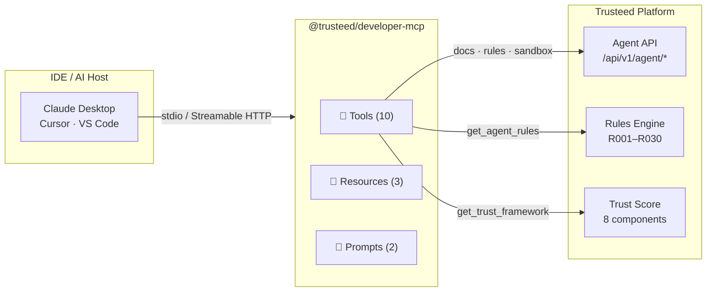
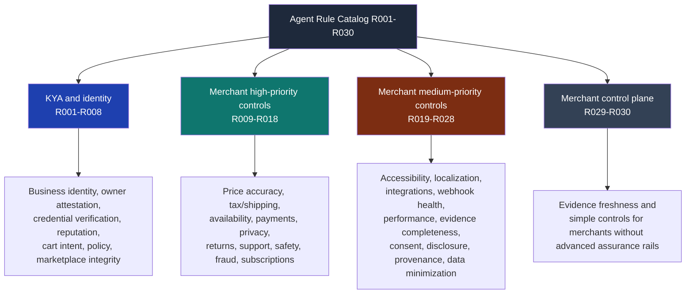
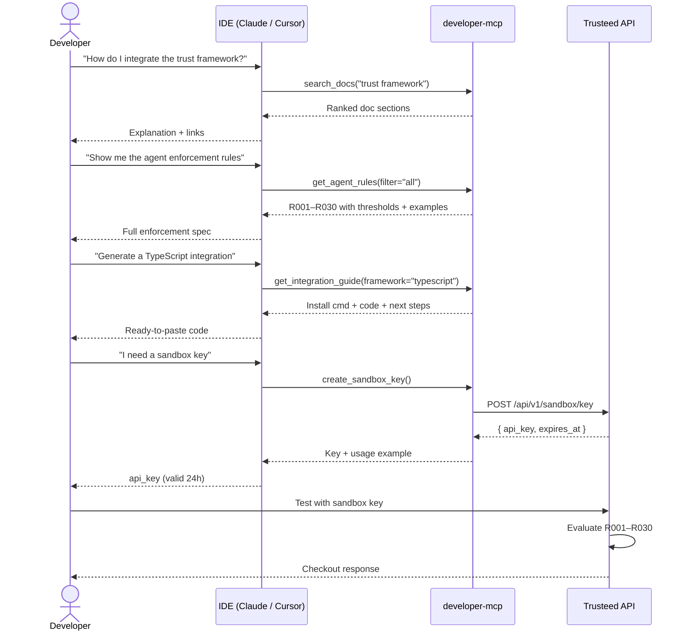

[English](README.md) | [**Español**](README.es.md) | [Français](README.fr.md) | [Deutsch](README.de.md)

# @trusteed/developer-mcp

**Asistente de integración para las APIs de políticas de agentes del lado del comercio, trust scoring y checkout enforcement de [Trusteed](https://www.trusteed.xyz).**

Este es un servidor MCP público, de solo lectura, para **desarrollo y capacitación de desarrolladores**: responde preguntas, devuelve las reglas de agente del comercio (R001–R030), muestra los fragmentos de OpenAPI, genera código de integración para los frameworks más comunes y emite claves de sandbox de corta duración. Está pensado para convivir con tu IDE mientras construyes tu integración con Trusteed.

**No** es un runtime de checkout. El enforcement en producción ocurre a través de la API de Trusteed, los plugins de comercio (Shopify, WooCommerce, PrestaShop, Odoo, Magento, Wix) y el RuleSnapshot firmado que esos plugins obtienen offline. Las decisiones que un LLM produce a partir de las respuestas de este MCP son guía documental, no autorización.

Funciona con Claude Desktop, Cursor, VS Code y cualquier host compatible con MCP. No se requiere autenticación para las herramientas de documentación; `create_sandbox_key` tiene límite de tasa por IP.

---

## Cuándo NO usar este MCP

Este servidor es intencionalmente acotado. No lo uses para:

- **Decisiones de autorización en producción.** La salida de `get_agent_rules` describe cómo _funcionan_ R001–R030; no las _ejecuta_. Llama a `POST /api/v1/rules/evaluate` (o recupera el RuleSnapshot firmado para enforcement offline) para cualquier decisión real de permitir/bloquear.
- **Almacenar o rotar secretos.** Nunca pegues claves de API de larga duración, credenciales de comercio ni tokens de producción en prompts que lleguen a este MCP. Las claves de sandbox devueltas por `create_sandbox_key` están diseñadas para ser desechables (TTL de 24 h); los límites de tasa se aplican en el servidor.
- **Manejar datos PCI, PII o de pago.** Las herramientas devuelven únicamente documentación, esquemas y metadatos de configuración. Ningún PAN, PII o contenido de pedido pasa por este servidor.
- **Certificación de cumplimiento.** Las explicaciones generadas por un LLM sobre el framework de confianza o la semántica de las reglas no son legalmente vinculantes. Usa las fuentes canónicas (la [página de metodología de confianza](https://www.trusteed.xyz/trust/methodology), el [agent-policy.json](https://www.trusteed.xyz/.well-known/agent-policy.json), la especificación OpenAPI) para cualquier revisión de cumplimiento, auditoría o legal.
- **Acceso programático de alto volumen.** El modo HTTP tiene límite de tasa (100 req / 15 min / IP). Para ingesta masiva de documentación, replica las fuentes de OpenAPI y Markdown directamente desde el sitio público o el repositorio.

Si necesitas un servidor que _ejecute_ acciones de comercio en nombre de un agente (carritos, checkouts, pagos), eso es un asunto distinto: Trusteed expone eso mediante el servidor MCP por comercio documentado en `trusteed.xyz/:storeSlug/mcp` y mediante los plugins de comercio. Este paquete no crecerá para convertirse en eso.

---

## Inicio rápido

### npx (ejecución puntual)

```bash
npx @trusteed/developer-mcp
```

### Claude Desktop

Añade a `~/Library/Application Support/Claude/claude_desktop_config.json`:

```json
{
  "mcpServers": {
    "trusteed": {
      "command": "npx",
      "args": ["-y", "@trusteed/developer-mcp"]
    }
  }
}
```

### Cursor / VS Code

Añade a `.cursor/mcp.json` o `.vscode/mcp.json`:

```json
{
  "servers": {
    "trusteed": {
      "command": "npx",
      "args": ["-y", "@trusteed/developer-mcp"]
    }
  }
}
```

### Modo HTTP (remoto / multi-cliente)

```bash
npx @trusteed/developer-mcp --http --port=3100
# POST http://localhost:3100/mcp
# Límite de tasa: 100 req / 15 min por IP
```

---

## Visión general de la arquitectura



---

## Herramientas (Tools)

### `search_docs`

Busca en la documentación de Trusteed por palabra clave. Devuelve resultados ordenados por relevancia del framework de confianza, la referencia de la API, las especificaciones de protocolo, las guías de integración y el glosario.

| Parámetro | Tipo         | Requerido | Descripción                                                                    |
| --------- | ------------ | --------- | ------------------------------------------------------------------------------ |
| `query`   | string       | ✅        | Términos de búsqueda (p. ej. `"trust score"`, `"x402 protocol"`)               |
| `section` | enum         | —         | Filtro: `api` · `trust` · `protocols` · `integration` · `glossary` · `general` |
| `limit`   | integer 1–20 | —         | Máximo de resultados (por defecto: 5)                                          |

---

### `get_agent_rules`

Devuelve las 30 reglas de agente del comercio (R001–R030) con niveles (tiers), umbrales configurables, condiciones de disparo y ejemplos. La referencia principal para implementar el modelo de enforcement de Trusteed. Estas reglas no requieren eIDAS, QTSP, Visa Verifier ni evidencia específica de red de pago, salvo que un comercio configure explícitamente dicha evidencia en otro lugar.

| Parámetro | Tipo   | Requerido | Descripción                                                                |
| --------- | ------ | --------- | --------------------------------------------------------------------------- |
| `filter`  | enum   | —         | `all` · `tier1` · `tier2` · `needs_lookup` · `no_lookup` (por defecto: `all`) |
| `code`    | string | —         | Una sola regla por código, p. ej. `R007`. Tiene prioridad sobre `filter`.  |

---

### `get_trust_framework`

Devuelve la metodología completa de trust scoring del comercio: 8 componentes ponderados, la fórmula de ranking publicada, los estados de visibilidad del comercio y los niveles de verificación.

Sin parámetros.

---

### `get_protocol_info`

Detalles sobre los tres protocolos de pago agéntico soportados: ACP (Stripe/OpenAI), AP2 (Google), x402 (stablecoin USDC). Incluye el flujo de pago, las medidas de seguridad y los identificadores de adaptador.

| Parámetro  | Tipo   | Requerido | Descripción                                                              |
| ---------- | ------ | --------- | -------------------------------------------------------------------------- |
| `protocol` | string | —         | `ACP` · `AP2` · `x402`. Omítelo para una comparación lado a lado de los tres. |

---

### `get_openapi_schema`

Devuelve el fragmento OpenAPI 3.0 para un endpoint específico de la Agent API.

| Parámetro  | Tipo   | Requerido | Descripción                                                                                       |
| ---------- | ------ | --------- | --------------------------------------------------------------------------------------------------- |
| `resource` | string | ✅        | `search` · `products` · `compare` · `availability` · `cart` · `checkout` · `orders` · `merchants` |

---

### `get_integration_guide`

Guía de integración paso a paso con código funcional para un framework específico.

| Parámetro   | Tipo   | Requerido | Descripción                                                                    |
| ----------- | ------ | --------- | --------------------------------------------------------------------------------- |
| `framework` | string | ✅        | `typescript` · `python` · `langchain` · `vercel-ai` · `openai-agents` · `curl` |

---

### `create_sandbox_key`

Genera una clave de API temporal de 24 horas para pruebas sin necesidad de registro. Los límites de tasa se aplican en el servidor.

Sin parámetros.

---

### `get_extension_manifest_schema`

Devuelve el esquema del manifiesto de extensión de Trusteed: campos requeridos, restricciones por campo con notas orientadas al desarrollador, y el sobre de firma (JWS Compact Ed25519, canonicalización RFC 8785, contrafirma del desarrollador + de Trusteed). Solo documentación; para validación en runtime, usa el linter `@trusteed/sdk-extension` o recupera la URL del esquema canónico.

Sin parámetros.

---

### `get_webhook_event_schema`

Devuelve el contrato de entrega de webhooks de Trusteed: estructura del sobre, cadena canónica HMAC-SHA256 `v1.{ts}.{nonce}.{METHOD}.{path}.{sha256_hex(body)}`, calendario de reintentos `[5s, 30s, 5min, 1h, 6h]` con DLQ en el intento 6, semántica de circuit-breaker y resúmenes de payload por evento.

| Parámetro    | Tipo   | Requerido | Descripción                                                                                                                                                                                                                                              |
| ------------ | ------ | --------- | ------------------------------------------------------------------------------------------------------------------------------------------------------------------------------------------------------------------------------------------------------- |
| `event_type` | string | —         | Un solo evento a detallar. Uno de: `agent.first_seen`, `agent.identified`, `checkout.created`, `checkout.completed`, `checkout.cancelled`, `checkout.blocked`, `refund.issued`, `rule.triggered`. Omítelo para el sobre completo + referencia de firma. |

---

### `get_extension_scopes`

Devuelve el catálogo de valores enum de `scopes_requested` con clasificación de datos (público / operacional / sensible / PII), indicador de PII, impacto mínimo en `risk_category`, un caso de uso de ejemplo y un caso de "no uso" explícito. Ancla el principio de alcance mínimo viable: las extensiones que tocan `customers:read:pii` reciben revisión manual, `risk_category` alto y una conversión de instalación más lenta.

| Parámetro | Tipo   | Requerido | Descripción                                                                                                                                                                                                                                                                                                                                                       |
| --------- | ------ | --------- | ------------------------------------------------------------------------------------------------------------------------------------------------------------------------------------------------------------------------------------------------------------------------------------------------------------------------------------------------------------------- |
| `scope`   | string | —         | Un solo nombre de scope en el que enfocarse. Uno de: `events:subscribe:checkout`, `events:subscribe:rules`, `events:subscribe:refunds`, `events:subscribe:agents`, `agents:read`, `agents:read:reputation`, `checkouts:read`, `checkouts:read:pricing`, `customers:read:pii`, `rules:read`, `merchant_config:read:public`, `extension_config:write`. Omítelo para el catálogo completo. |

---

## Puntos de control de agente — R001–R030

Estas 30 reglas constituyen el **catálogo de reglas de comercio de Trusteed**: una capa de política para comercio agéntico, riesgo de checkout, controles del comercio y protección del cliente. Son reglas ordinarias de comercio/catálogo. No requieren eIDAS, QTSP, Visa Verifier ni ningún proveedor de identidad regulado, salvo que un comercio configure por separado esas integraciones de mayor garantía.

La fuente pública de verdad es la herramienta MCP `get_agent_rules`, que devuelve cada regla con código, categoría, madurez, severidad, fase de evaluación, descripción, acción por defecto, expectativas de evidencia y ejemplos.



### Tabla resumen de reglas

Para descripciones completas, parámetros configurables, dependencias de atributos de carrito y ejemplos de integración, consulta **[docs/agent-rules-reference.md](docs/agent-rules-reference.md)**.

| Código | Nombre                          | Función                                                                 |
| ------ | ------------------------------- | ------------------------------------------------------------------------ |
| R001   | `verified-agent-required`       | Bloquea el checkout cuando no hay una identidad de agente verificada     |
| R002   | `signature-spoof-block`         | Bloquea firmas de token de agente inválidas o no verificables            |
| R003   | `mandate-boundary-match`        | Aplica el tope de gasto del mandato del operador y la lista de categorías permitidas |
| R004   | `new-key-friction`              | Añade fricción cuando se usa una clave de agente recién emitida          |
| R005   | `revoked-agent-block`           | Bloquea agentes revocados o con fallos de identidad repetidos            |
| R006   | `provider-confidence-tier`      | Aplica un trust score mínimo y una confianza de proveedor mínima          |
| R007   | `cross-merchant-abuse-signal`   | Bloquea agentes señalados por 2+ comercios en los últimos 30 días         |
| R008   | `scope-escalation-detection`    | Bloquea solicitudes que excedan los scopes de agente autorizados por el comercio |
| R009   | `agent-verification-required`   | Réplica, del lado del comercio, de R001 para operaciones de catálogo y sesión |
| R010   | `new-agent-probation`           | Requiere un número mínimo de pedidos previos completados                 |
| R011   | `repeat-failed-checkout`        | Bloquea agentes que superan los intentos fallidos de checkout en una ventana de tiempo |
| R012   | `high-risk-category`            | Bloquea pedidos que contengan categorías de producto de alto riesgo definidas por el comercio |
| R013   | `return-policy-guard`           | Bloquea cuando las expectativas de devolución del agente entran en conflicto con la política del comercio |
| R014   | `delivery-risk-guard`           | Bloquea países de entrega de alto riesgo y cancelaciones repetidas tras el envío |
| R015   | `price-change-guard`            | Bloquea cuando el precio del carrito ha variado más allá de un delta permitido |
| R016   | `stock-confidence-guard`        | Bloquea cuando el stock de una línea de producto cae por debajo del mínimo requerido |
| R017   | `coupon-discount-anomaly`       | Limita los intentos de código de descuento y la profundidad máxima de descuento |
| R018   | `cart-composition-guard`        | Detecta picos de pedidos, abuso de cantidad de artículos y abuso de cantidad en un solo SKU |
| R019   | `country-jurisdiction`          | Restringe los pedidos a países permitidos o bloquea jurisdicciones específicas |
| R020   | `business-hours`                | Restringe los pedidos agénticos al horario comercial del comercio en su zona horaria local |
| R021   | `first-purchase-with-merchant`  | Marca para revisión las primeras compras de un agente con el comercio     |
| R022   | `payment-rail-restriction`      | Aplica una lista de permitidos o de bloqueados de métodos de pago         |
| R023   | `refund-abuse-guard`            | Bloquea agentes con una proporción de reembolsos alta en una ventana móvil |
| R024   | `dispute-history-guard`         | Bloquea agentes con demasiadas disputas de pago recientes                 |
| R025   | `sensitive-delivery-address`    | Bloquea apartados postales y direcciones de reenvío de mercancía          |
| R026   | `subscription-autorenew-guard`  | Requiere consentimiento explícito antes de procesar cargos de renovación automática |
| R027   | `gift-card-stored-value`        | Limita los importes de compra de valor almacenado / tarjetas regalo por transacción |
| R028   | `b2b-po-guard`                  | Requiere evidencia de orden de compra para pedidos B2B                    |
| R029   | `merchant-preset`               | Aplica uno de cuatro presets de riesgo con nombre (abierto/equilibrado/estricto/regulado) |
| R030   | `simple-controls`               | Tope de importe y restricción de país sin rieles de evidencia avanzados   |

La Checkout Enforcement Layer interna también mantiene los evaluadores legacy R001–R010 para comercios y snapshots de plugin existentes. Las integraciones nuevas deben tratar los códigos de regla como cadenas opacas y usar la salida actual de `get_agent_rules` en lugar de codificar nombres antiguos de forma fija o asumir exactamente diez reglas.

---

### Configurar reglas vía la API

Pasa un objeto `merchantPolicies` al endpoint de evaluación de reglas:

```bash
POST https://www.trusteed.xyz/api/v1/rules/evaluate
Content-Type: application/json
X-Agent-Api-Key: <your-key>

{
  "agentId": "agent_abc123",
  "agentTrustScore": 42,
  "orderContext": {
    "cartTotalCents": 8500,
    "billingCountry": "ES",
    "lineItems": [{ "productId": "p1", "quantity": 2 }],
    "paymentMethod": "stripe_card"
  },
  "merchantPolicies": {
    "r002": { "threshold": 40 },
    "r003": { "windowSeconds": 30, "maxAttempts": 3 },
    "r005": { "maxRatio": 0.3 },
    "r010": { "stripeRiskLevel": "elevated" }
  }
}
```

Para **enforcement offline** (del lado del plugin, sin llamada de red), recupera el snapshot de reglas firmado:

```bash
GET https://www.trusteed.xyz/:storeSlug/rules-snapshot
# Devuelve un RuleSnapshot firmado con JWS, válido durante 5 minutos
```

---

## Flujo de trabajo del desarrollador



---

## Recursos (Resources)

Los recursos son datos de referencia pasivos, legibles por los agentes en cualquier momento.

| URI                     | MIME               | Descripción                                                                             |
| ----------------------- | ------------------ | ------------------------------------------------------------------------------------------ |
| `docs://llms.txt`       | `text/plain`       | Manifiesto de la plataforma — endpoints, límites de tasa, resumen del trust score           |
| `policy://agent-policy` | `application/json` | Políticas de acción del agente: rangos de trust score, requisitos de confirmación, reglas de fail-safe |
| `spec://openapi`        | `application/json` | Resumen de la especificación OpenAPI 3.0 de todos los endpoints de la Agent API             |

---

## Prompts

| Nombre               | Descripción                            | Parámetros                                     |
| --------------------- | --------------------------------------- | ------------------------------------------------ |
| `integration_helper` | Flujo de integración guiado             | `framework` (opcional), `useCase` (opcional)    |
| `troubleshoot`       | Depurar errores comunes de la API       | `error` (opcional), `endpoint` (opcional)       |

---

## Modos de transporte

| Modo               | Comando                                          | Caso de uso                                                    |
| ------------------ | ------------------------------------------------- | ------------------------------------------------------------------ |
| `stdio` (por defecto) | `npx @trusteed/developer-mcp`                   | Claude Desktop, Cursor, VS Code — un proceso por host              |
| `HTTP`              | `npx @trusteed/developer-mcp --http --port=3100` | Despliegue remoto, múltiples clientes, pipelines de CI             |

El modo HTTP es sin estado (un servidor por solicitud). CORS está abierto (`*`). Límite de tasa: 100 solicitudes / 15 minutos por IP.

---

## Enlaces

- Plataforma: [trusteed.xyz](https://www.trusteed.xyz)
- Tienda demo — playground de reglas en vivo: [trusteed.xyz/en/demo-store](https://www.trusteed.xyz/en/demo-store)
- Política del agente: [trusteed.xyz/.well-known/agent-policy.json](https://www.trusteed.xyz/.well-known/agent-policy.json)
- Playbooks de agente: [trusteed.xyz/.well-known/agent-playbooks.json](https://www.trusteed.xyz/.well-known/agent-playbooks.json)
- Manifiesto MCP: [trusteed.xyz/.well-known/mcp.json](https://www.trusteed.xyz/.well-known/mcp.json)

---

## Agradecimientos

Este servidor MCP expone integraciones construidas sobre los siguientes protocolos y plataformas externos. Son dependencias de infraestructura, no colaboradores formales, pero hacen posible la capa de comercio agéntico.

| Partner | Rol | Integración |
| ------- | --- | ----------- |
| [Stripe](https://stripe.com) | Infraestructura de pago fiat | Protocolo ACP (sesiones de checkout OpenAI/Stripe); R011 repeat-failed-checkout usa las señales de riesgo de Stripe Radar cuando el método de pago es Stripe |
| [OpenAI](https://openai.com) | Coautor del protocolo ACP | Agentic Commerce Protocol (ACP) para pagos fiat mediados por agente |
| [Google](https://developers.google.com) | Protocolo AP2 | Agent Payment Protocol v2 — Google Cart Mandate para pagos mediados por agente |
| [Coinbase](https://www.coinbase.com/developer-platform) | Riel de stablecoin x402 | Infraestructura de pago USDC para el protocolo x402 |
| [Cloudflare](https://cloudflare.com) | Coautor de x402 | Estándar abierto x402 para pagos de stablecoin nativos de HTTP |
| [Anthropic / MCP](https://modelcontextprotocol.io) | Protocolo de transporte | SDK del Model Context Protocol (`@modelcontextprotocol/sdk`) |

**Integraciones de mayor garantía** (disponibles en la plataforma Trusteed para comercios que lo activen opcionalmente, no requeridas por defecto):

| Partner | Rol |
| ------- | --- |
| [HUMAN Security](https://www.humansecurity.com) | Verificación de identidad de agente vía AgenticTrust — Firmas de Mensaje HTTP RFC 9421 para agentes compradores |
| Visa (TAP) | Trusted Agent Protocol — etiquetas de firma `agent-browser-auth` / `agent-payer-auth` para agentes verificados por Visa |
| [InfoCert (QTSP)](https://infocert.eu) | Firmas electrónicas y sellos de tiempo cualificados eIDAS para los trust receipts |

Estas integraciones de mayor garantía dependen de la configuración del comercio y no son invocadas por este servidor MCP de documentación. Consulta la metodología de confianza de la plataforma para más detalles.

---

## Licencia

MIT
