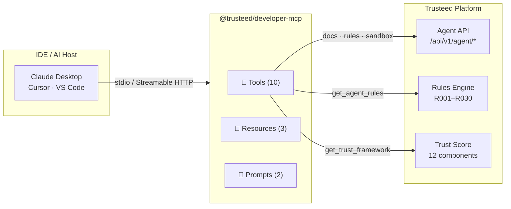
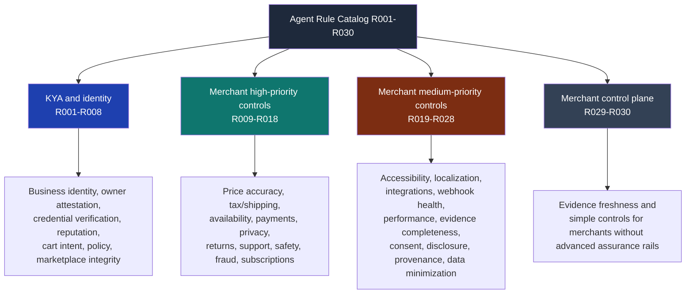
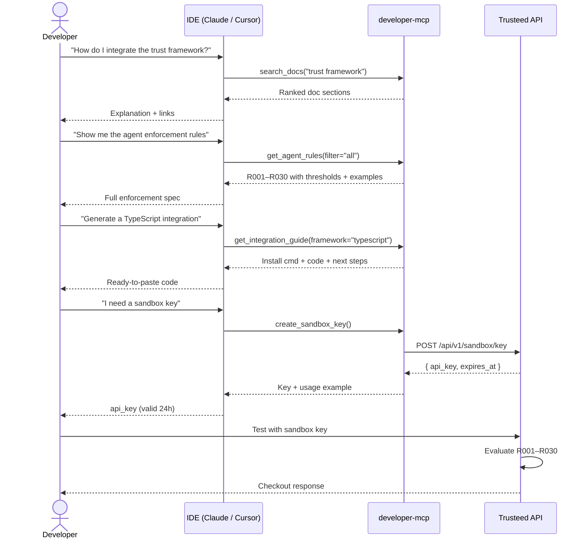

[English](README.md) | [Español](README.es.md) | [**Français**](README.fr.md) | [Deutsch](README.de.md)

# @trusteed/developer-mcp

**Assistant d'intégration pour les API de politique d'agent côté marchand, de trust scoring et de checkout enforcement de [Trusteed](https://www.trusteed.xyz).**

Ceci est un serveur MCP public, en lecture seule, destiné à **l'accompagnement des développeurs** : il répond aux questions, renvoie les règles d'agent marchand (R001–R030), affiche les fragments OpenAPI, génère du code d'intégration pour les frameworks les plus courants et délivre des clés sandbox de courte durée. Il est conçu pour cohabiter avec votre IDE pendant que vous développez votre intégration avec Trusteed.

Ce n'est **pas** un runtime de checkout. L'enforcement en production s'effectue via l'API Trusteed, les plugins marchands (Shopify, WooCommerce, PrestaShop, Odoo, Magento, Wix) et le RuleSnapshot signé récupéré hors ligne par ces plugins. Les décisions produites par un LLM à partir des réponses de ce MCP constituent une aide documentaire, pas une autorisation.

Compatible avec Claude Desktop, Cursor, VS Code et tout host compatible MCP. Aucune authentification requise pour les outils de documentation ; `create_sandbox_key` est soumis à une limite de débit par IP.

---

## Quand NE PAS utiliser ce MCP

Ce serveur est volontairement restreint. Ne l'utilisez pas pour :

- **Les décisions d'autorisation en production.** La sortie de `get_agent_rules` décrit le _fonctionnement_ des règles R001–R030 ; elle ne les _exécute_ pas. Appelez `POST /api/v1/rules/evaluate` (ou récupérez le RuleSnapshot signé pour l'enforcement hors ligne) pour toute décision réelle d'autorisation ou de blocage.
- **Le stockage ou la rotation de secrets.** Ne collez jamais de clés API longue durée, d'identifiants marchands ou de jetons de production dans des prompts atteignant ce MCP. Les clés sandbox renvoyées par `create_sandbox_key` sont conçues pour être jetables (TTL de 24 h) ; les limites de débit sont appliquées côté serveur.
- **Le traitement de données PCI, PII ou de paiement.** Les outils ne renvoient que de la documentation, des schémas et des métadonnées de configuration. Aucun PAN, aucune PII ni aucun contenu de commande ne transite par ce serveur.
- **L'attestation de conformité.** Les explications générées par un LLM sur le framework de confiance ou la sémantique des règles n'ont aucune valeur juridique. Utilisez les sources canoniques (la [page de méthodologie de confiance](https://www.trusteed.xyz/trust/methodology), le [agent-policy.json](https://www.trusteed.xyz/.well-known/agent-policy.json), la spécification OpenAPI) pour toute revue de conformité, d'audit ou juridique.
- **L'accès programmatique à haut volume.** Le mode HTTP est soumis à une limite de débit (100 req / 15 min / IP). Pour une ingestion massive de documentation, répliquez directement les sources OpenAPI et Markdown depuis le site public ou le dépôt.

Si vous avez besoin d'un serveur qui _exécute_ des actions commerciales pour le compte d'un agent (paniers, checkouts, paiements), il s'agit d'un autre sujet : Trusteed expose cela via le serveur MCP par marchand documenté à `trusteed.xyz/:storeSlug/mcp` et via les plugins marchands. Ce package n'évoluera pas dans cette direction.

---

## Démarrage rapide

### npx (exécution ponctuelle)

```bash
npx @trusteed/developer-mcp
```

### Claude Desktop

Ajoutez à `~/Library/Application Support/Claude/claude_desktop_config.json` :

```json
{
  "mcpServers": {
    "trusteed": {
      "command": "npx",
      "args": ["-y", "@trusteed/developer-mcp"]
    }
  }
}
```

### Cursor / VS Code

Ajoutez à `.cursor/mcp.json` ou `.vscode/mcp.json` :

```json
{
  "servers": {
    "trusteed": {
      "command": "npx",
      "args": ["-y", "@trusteed/developer-mcp"]
    }
  }
}
```

### Mode HTTP (distant / multi-client)

```bash
npx @trusteed/developer-mcp --http --port=3100
# POST http://localhost:3100/mcp
# Limite de débit : 100 req / 15 min par IP
```

---

## Vue d'ensemble de l'architecture



---

## Outils (Tools)

### `search_docs`

Recherche par mot-clé dans la documentation Trusteed. Renvoie des résultats classés issus du framework de confiance, de la référence API, des spécifications de protocole, des guides d'intégration et du glossaire.

| Paramètre | Type         | Requis | Description                                                                     |
| --------- | ------------ | ------ | ---------------------------------------------------------------------------------- |
| `query`   | string       | ✅     | Termes de recherche (ex. `"trust score"`, `"x402 protocol"`)                      |
| `section` | enum         | —      | Filtre : `api` · `trust` · `protocols` · `integration` · `glossary` · `general`   |
| `limit`   | integer 1–20 | —      | Nombre max de résultats (par défaut : 5)                                          |

---

### `get_agent_rules`

Renvoie les 30 règles d'agent marchand (R001–R030) avec leurs niveaux (tiers), seuils configurables, conditions de déclenchement et exemples. La référence principale pour implémenter le modèle d'enforcement Trusteed. Ces règles ne nécessitent ni eIDAS, ni QTSP, ni Visa Verifier, ni preuve spécifique à un réseau de paiement, sauf configuration explicite par un marchand ailleurs.

| Paramètre | Type   | Requis | Description                                                                    |
| --------- | ------ | ------ | ---------------------------------------------------------------------------------- |
| `filter`  | enum   | —      | `all` · `tier1` · `tier2` · `needs_lookup` · `no_lookup` (par défaut : `all`)     |
| `code`    | string | —      | Une seule règle par code, ex. `R007`. Prend le pas sur `filter`.                  |

---

### `get_trust_framework`

Renvoie la méthodologie complète de trust scoring marchand : 12 composantes pondérées, la formule de classement publiée, les états de visibilité marchand et les niveaux de vérification.

Aucun paramètre.

---

### `get_protocol_info`

Détails sur les trois protocoles de paiement agentique pris en charge : ACP (Stripe/OpenAI), AP2 (Google), x402 (stablecoin USDC). Inclut le flux de paiement, les mesures de sécurité et les identifiants d'adaptateur.

| Paramètre  | Type   | Requis | Description                                                                 |
| ---------- | ------ | ------ | -------------------------------------------------------------------------------- |
| `protocol` | string | —      | `ACP` · `AP2` · `x402`. Omettez pour une comparaison côte à côte des trois.      |

---

### `get_openapi_schema`

Renvoie le fragment OpenAPI 3.0 pour un endpoint spécifique de l'Agent API.

| Paramètre  | Type   | Requis | Description                                                                                       |
| ---------- | ------ | ------ | ------------------------------------------------------------------------------------------------------ |
| `resource` | string | ✅     | `search` · `products` · `compare` · `availability` · `cart` · `checkout` · `orders` · `merchants`      |

---

### `get_integration_guide`

Guide d'intégration pas à pas avec du code fonctionnel pour un framework spécifique.

| Paramètre   | Type   | Requis | Description                                                                     |
| ----------- | ------ | ------ | ------------------------------------------------------------------------------------ |
| `framework` | string | ✅     | `typescript` · `python` · `langchain` · `vercel-ai` · `openai-agents` · `curl`       |

---

### `create_sandbox_key`

Génère une clé API temporaire de 24 heures pour effectuer des tests sans inscription. Les limites de débit sont appliquées côté serveur.

Aucun paramètre.

---

### `get_extension_manifest_schema`

Renvoie le schéma du manifeste d'extension Trusteed : champs requis, contraintes par champ avec notes destinées aux développeurs, et l'enveloppe de signature (JWS Compact Ed25519, canonicalisation RFC 8785, contre-signature du développeur + de Trusteed). Documentation uniquement — pour une validation à l'exécution, utilisez le linter `@trusteed/sdk-extension` ou récupérez l'URL du schéma canonique.

Aucun paramètre.

---

### `get_webhook_event_schema`

Renvoie le contrat de livraison des webhooks Trusteed : structure de l'enveloppe, chaîne canonique HMAC-SHA256 `v1.{ts}.{nonce}.{METHOD}.{path}.{sha256_hex(body)}`, calendrier de nouvelles tentatives `[5s, 30s, 5min, 1h, 6h]` avec DLQ à la 6ᵉ tentative, sémantique du circuit-breaker, et résumés de payload par type d'événement.

| Paramètre    | Type   | Requis | Description                                                                                                                                                                                                                                       |
| ------------ | ------ | ------ | -------------------------------------------------------------------------------------------------------------------------------------------------------------------------------------------------------------------------------------------------------- |
| `event_type` | string | —      | Un seul événement à détailler. Parmi : `agent.first_seen`, `agent.identified`, `checkout.created`, `checkout.completed`, `checkout.cancelled`, `checkout.blocked`, `refund.issued`, `rule.triggered`. Omettez pour l'enveloppe complète + la référence de signature. |

---

### `get_extension_scopes`

Renvoie le catalogue des valeurs enum de `scopes_requested` avec la classification des données (public / opérationnel / sensible / PII), l'indicateur PII, l'impact minimal sur `risk_category`, un cas d'usage type et un cas de « non-usage » explicite. Ancre le principe du périmètre minimal viable : les extensions accédant à `customers:read:pii` font l'objet d'une revue manuelle, d'une `risk_category` élevée et d'une conversion d'installation plus lente.

| Paramètre | Type   | Requis | Description                                                                                                                                                                                                                                                                                                                                                          |
| --------- | ------ | ------ | -------------------------------------------------------------------------------------------------------------------------------------------------------------------------------------------------------------------------------------------------------------------------------------------------------------------------------------------------------------------------- |
| `scope`   | string | —      | Un seul nom de scope à cibler. Parmi : `events:subscribe:checkout`, `events:subscribe:rules`, `events:subscribe:refunds`, `events:subscribe:agents`, `agents:read`, `agents:read:reputation`, `checkouts:read`, `checkouts:read:pricing`, `customers:read:pii`, `rules:read`, `merchant_config:read:public`, `extension_config:write`. Omettez pour le catalogue complet. |

---

## Points de contrôle d'agent — R001–R030

Ces 30 règles constituent le **catalogue de règles marchand Trusteed** : une couche de politique pour le commerce agentique, le risque de checkout, les contrôles marchands et la protection du client. Ce sont des règles ordinaires de type marchand/catalogue. Elles ne nécessitent ni eIDAS, ni QTSP, ni Visa Verifier, ni aucun fournisseur d'identité réglementé, sauf si un marchand configure séparément ces intégrations à assurance renforcée.

La source publique de vérité est l'outil MCP `get_agent_rules`, qui renvoie chaque règle avec son code, sa catégorie, sa maturité, sa sévérité, sa phase d'évaluation, sa description, son action par défaut, les attentes en matière de preuve et des exemples.



### Tableau récapitulatif des règles

Pour les descriptions complètes, les paramètres configurables, les dépendances aux attributs de panier et des exemples d'intégration, voir **[docs/agent-rules-reference.md](docs/agent-rules-reference.md)**.

| Code  | Nom                             | Fonction                                                                    |
| ----- | -------------------------------- | ------------------------------------------------------------------------------ |
| R001  | `verified-agent-required`       | Bloque le checkout en l'absence d'identité d'agent vérifiée                    |
| R002  | `signature-spoof-block`         | Bloque les signatures de jeton d'agent invalides ou non vérifiables            |
| R003  | `mandate-boundary-match`        | Applique le plafond de dépenses du mandat de l'opérateur et la liste de catégories autorisées |
| R004  | `new-key-friction`              | Ajoute de la friction lors de l'utilisation d'une clé d'agent récemment émise  |
| R005  | `revoked-agent-block`           | Bloque les agents révoqués ou ceux ayant des échecs d'identité répétés         |
| R006  | `provider-confidence-tier`      | Applique un trust score et un niveau de confiance de fournisseur minimaux      |
| R007  | `cross-merchant-abuse-signal`   | Bloque les agents signalés par 2+ marchands au cours des 30 derniers jours     |
| R008  | `scope-escalation-detection`    | Bloque les requêtes dépassant les scopes d'agent autorisés par le marchand     |
| R009  | `agent-verification-required`   | Miroir côté marchand de R001 pour les opérations de catalogue et de session    |
| R010  | `new-agent-probation`           | Exige un nombre minimal de commandes antérieures complétées                    |
| R011  | `repeat-failed-checkout`        | Bloque les agents dépassant les tentatives de checkout échouées sur une fenêtre de temps |
| R012  | `high-risk-category`            | Bloque les commandes contenant des catégories de produits à haut risque définies par le marchand |
| R013  | `return-policy-guard`           | Bloque lorsque les attentes de retour de l'agent entrent en conflit avec la politique du marchand |
| R014  | `delivery-risk-guard`           | Bloque les pays de livraison à haut risque et les annulations répétées après expédition |
| R015  | `price-change-guard`            | Bloque lorsque le prix du panier a varié au-delà d'un delta autorisé           |
| R016  | `stock-confidence-guard`        | Bloque lorsque le stock d'une ligne d'article passe en dessous du minimum requis |
| R017  | `coupon-discount-anomaly`       | Limite les tentatives de code promo et la profondeur maximale de remise        |
| R018  | `cart-composition-guard`        | Détecte les pics de commandes, l'abus de nombre d'articles et l'abus de quantité sur un seul SKU |
| R019  | `country-jurisdiction`          | Restreint les commandes aux pays autorisés ou bloque des juridictions spécifiques |
| R020  | `business-hours`                | Restreint les commandes agentiques aux heures d'ouverture du marchand dans son fuseau horaire local |
| R021  | `first-purchase-with-merchant`  | Signale pour revue les premiers achats d'un agent auprès du marchand           |
| R022  | `payment-rail-restriction`      | Applique une liste d'autorisation ou de blocage des méthodes de paiement       |
| R023  | `refund-abuse-guard`            | Bloque les agents ayant un taux de remboursement élevé sur une fenêtre glissante |
| R024  | `dispute-history-guard`         | Bloque les agents ayant trop de litiges de paiement récents                    |
| R025  | `sensitive-delivery-address`    | Bloque les boîtes postales et les adresses de réexpédition de fret             |
| R026  | `subscription-autorenew-guard`  | Exige un consentement explicite avant de traiter les charges de renouvellement automatique |
| R027  | `gift-card-stored-value`        | Plafonne les montants d'achat de valeur stockée / carte-cadeau par transaction |
| R028  | `b2b-po-guard`                  | Exige une preuve de bon de commande pour les commandes B2B                     |
| R029  | `merchant-preset`               | Applique l'un des quatre préréglages de risque nommés (abierto/equilibrado/estricto/regulado) |
| R030  | `simple-controls`               | Plafond de montant et restriction de pays sans rails de preuve avancés         |

La Checkout Enforcement Layer interne conserve également les évaluateurs legacy R001–R010 pour les marchands existants et les snapshots de plugins. Les nouvelles intégrations doivent traiter les codes de règle comme des chaînes opaques et utiliser la sortie actuelle de `get_agent_rules` plutôt que de coder en dur d'anciens noms ou de supposer exactement dix règles.

---

### Configurer les règles via l'API

Passez un objet `merchantPolicies` à l'endpoint d'évaluation des règles :

```bash
POST https://www.trusteed.xyz/api/v1/rules/evaluate
Content-Type: application/json
X-Agent-Api-Key: <your-key>

{
  "agentId": "agent_abc123",
  "agentTrustScore": 42,
  "orderContext": {
    "cartTotalCents": 8500,
    "billingCountry": "ES",
    "lineItems": [{ "productId": "p1", "quantity": 2 }],
    "paymentMethod": "stripe_card"
  },
  "merchantPolicies": {
    "r002": { "threshold": 40 },
    "r003": { "windowSeconds": 30, "maxAttempts": 3 },
    "r005": { "maxRatio": 0.3 },
    "r010": { "stripeRiskLevel": "elevated" }
  }
}
```

Pour un **enforcement hors ligne** (côté plugin, sans appel réseau), récupérez le snapshot de règles signé :

```bash
GET https://www.trusteed.xyz/:storeSlug/rules-snapshot
# Renvoie un RuleSnapshot signé en JWS, valable 5 minutes
```

---

## Flux de travail du développeur



---

## Ressources (Resources)

Les ressources sont des données de référence passives, lisibles par les agents à tout moment.

| URI                     | MIME               | Description                                                                             |
| ----------------------- | ------------------ | -------------------------------------------------------------------------------------------- |
| `docs://llms.txt`       | `text/plain`       | Manifeste de la plateforme — endpoints, limites de débit, résumé du trust score               |
| `policy://agent-policy` | `application/json` | Politiques d'action de l'agent : plages de trust score, exigences de confirmation, règles de fail-safe |
| `spec://openapi`        | `application/json` | Résumé de la spécification OpenAPI 3.0 pour tous les endpoints de l'Agent API                 |

---

## Prompts

| Nom                  | Description                          | Paramètres                                     |
| --------------------- | ------------------------------------- | -------------------------------------------------- |
| `integration_helper` | Flux d'intégration guidé              | `framework` (facultatif), `useCase` (facultatif)  |
| `troubleshoot`       | Déboguer les erreurs API courantes    | `error` (facultatif), `endpoint` (facultatif)     |

---

## Modes de transport

| Mode                | Commande                                          | Cas d'usage                                                         |
| -------------------- | -------------------------------------------------- | -------------------------------------------------------------------------- |
| `stdio` (par défaut) | `npx @trusteed/developer-mcp`                     | Claude Desktop, Cursor, VS Code — un processus par host                    |
| `HTTP`               | `npx @trusteed/developer-mcp --http --port=3100`  | Déploiement distant, clients multiples, pipelines CI                       |

Le mode HTTP est sans état (un serveur par requête). Le CORS est ouvert (`*`). Limite de débit : 100 requêtes / 15 minutes par IP.

---

## Liens

- Plateforme : [trusteed.xyz](https://www.trusteed.xyz)
- Boutique de démonstration — playground de règles en direct : [trusteed.xyz/en/demo-store](https://www.trusteed.xyz/en/demo-store)
- Politique d'agent : [trusteed.xyz/.well-known/agent-policy.json](https://www.trusteed.xyz/.well-known/agent-policy.json)
- Playbooks d'agent : [trusteed.xyz/.well-known/agent-playbooks.json](https://www.trusteed.xyz/.well-known/agent-playbooks.json)
- Manifeste MCP : [trusteed.xyz/.well-known/mcp.json](https://www.trusteed.xyz/.well-known/mcp.json)

---

## Remerciements

Ce serveur MCP expose des intégrations construites au-dessus des protocoles et plateformes externes suivants. Ce sont des dépendances d'infrastructure, pas des collaborateurs officiels, mais elles rendent possible la couche de commerce agentique.

| Partenaire | Rôle | Intégration |
| ---------- | ---- | ----------- |
| [Stripe](https://stripe.com) | Infrastructure de paiement fiat | Protocole ACP (sessions de checkout OpenAI/Stripe) ; R011 repeat-failed-checkout utilise les signaux de risque Stripe Radar lorsque la méthode de paiement est Stripe |
| [OpenAI](https://openai.com) | Co-auteur du protocole ACP | Agentic Commerce Protocol (ACP) pour les paiements fiat médiés par agent |
| [Google](https://developers.google.com) | Protocole AP2 | Agent Payment Protocol v2 — Google Cart Mandate pour les paiements médiés par agent |
| [Coinbase](https://www.coinbase.com/developer-platform) | Rail stablecoin x402 | Infrastructure de paiement USDC pour le protocole x402 |
| [Cloudflare](https://cloudflare.com) | Co-auteur de x402 | Standard ouvert x402 pour les paiements stablecoin natifs HTTP |
| [Anthropic / MCP](https://modelcontextprotocol.io) | Protocole de transport | SDK du Model Context Protocol (`@modelcontextprotocol/sdk`) |

**Intégrations à assurance renforcée** (disponibles sur la plateforme Trusteed pour les marchands qui le souhaitent, non requises par défaut) :

| Partenaire | Rôle |
| ---------- | ---- |
| [HUMAN Security](https://www.humansecurity.com) | Vérification d'identité d'agent via AgenticTrust — Signatures de message HTTP RFC 9421 pour les agents acheteurs |
| Visa (TAP) | Trusted Agent Protocol — tags de signature `agent-browser-auth` / `agent-payer-auth` pour les agents vérifiés par Visa |
| [InfoCert (QTSP)](https://infocert.eu) | Signatures électroniques et horodatages qualifiés eIDAS pour les trust receipts |

Ces intégrations à assurance renforcée dépendent de la configuration du marchand et ne sont pas invoquées par ce serveur MCP de documentation. Voir la méthodologie de confiance de la plateforme pour plus de détails.

---

## Licence

MIT
