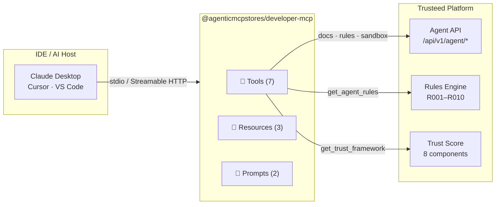
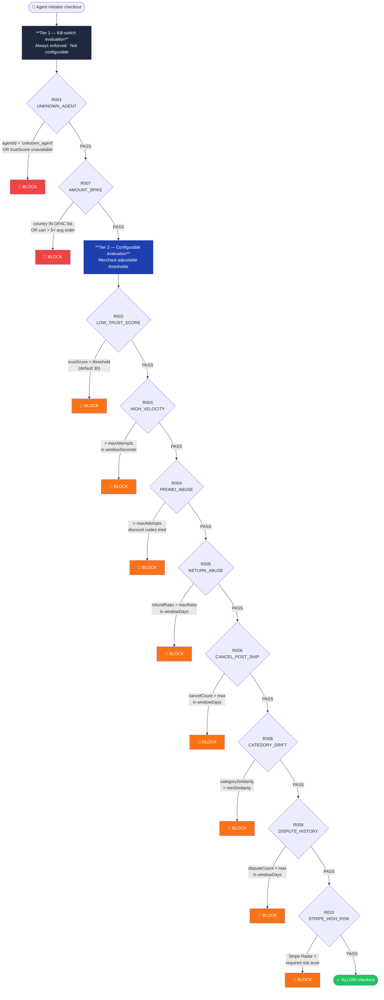

# @agenticmcpstores/developer-mcp

Public MCP server that exposes the [Trusteed](https://www.trusteed.xyz) agentic commerce platform as interactive tools for IDEs and AI agents. Includes the complete **Agent Control Points** specification (R001–R010) — the enforcement rules that govern when autonomous checkouts are allowed, reviewed, or blocked.

Works with Claude Desktop, Cursor, VS Code, and any MCP-compatible host. No authentication required.

---

## Quick start

### npx (one-time run)

```bash
npx @agenticmcpstores/developer-mcp
```

### Claude Desktop

Add to `~/Library/Application Support/Claude/claude_desktop_config.json`:

```json
{
  "mcpServers": {
    "agenticmcpstores": {
      "command": "npx",
      "args": ["-y", "@agenticmcpstores/developer-mcp"]
    }
  }
}
```

### Cursor / VS Code

Add to `.cursor/mcp.json` or `.vscode/mcp.json`:

```json
{
  "servers": {
    "agenticmcpstores": {
      "command": "npx",
      "args": ["-y", "@agenticmcpstores/developer-mcp"]
    }
  }
}
```

### HTTP mode (remote / multi-client)

```bash
npx @agenticmcpstores/developer-mcp --http --port=3100
# POST http://localhost:3100/mcp
# Rate limit: 100 req / 15 min per IP
```

---

## Architecture overview



---

## Tools

### `search_docs`

Search the Trusteed documentation by keyword. Returns ranked results from the trust framework, API reference, protocol specs, integration guides, and glossary.

| Parameter | Type         | Required | Description                                                                    |
| --------- | ------------ | -------- | ------------------------------------------------------------------------------ |
| `query`   | string       | ✅       | Search terms (e.g. `"trust score"`, `"x402 protocol"`)                         |
| `section` | enum         | —        | Filter: `api` · `trust` · `protocols` · `integration` · `glossary` · `general` |
| `limit`   | integer 1–20 | —        | Max results (default: 5)                                                       |

---

### `get_agent_rules`

Returns the 10 Agent Control Points (R001–R010) with tiers, configurable thresholds, trigger conditions, and examples. The primary reference for implementing the Trusteed enforcement model.

| Parameter | Type   | Required | Description                                                               |
| --------- | ------ | -------- | ------------------------------------------------------------------------- |
| `filter`  | enum   | —        | `all` · `tier1` · `tier2` · `needs_lookup` · `no_lookup` (default: `all`) |
| `code`    | string | —        | Single rule by code, e.g. `R007`. Overrides `filter`.                     |

---

### `get_trust_framework`

Returns the full merchant trust scoring methodology: 8 weighted components, the published ranking formula, merchant visibility states, and verification levels.

No parameters.

---

### `get_protocol_info`

Details on the three supported agentic payment protocols: ACP (Stripe/OpenAI), AP2 (Google), x402 (USDC stablecoin). Includes payment flow, security measures, and adapter identifiers.

| Parameter  | Type   | Required | Description                                                              |
| ---------- | ------ | -------- | ------------------------------------------------------------------------ |
| `protocol` | string | —        | `ACP` · `AP2` · `x402`. Omit for a side-by-side comparison of all three. |

---

### `get_openapi_schema`

Returns the OpenAPI 3.0 fragment for a specific Agent API endpoint.

| Parameter  | Type   | Required | Description                                                                                       |
| ---------- | ------ | -------- | ------------------------------------------------------------------------------------------------- |
| `resource` | string | ✅       | `search` · `products` · `compare` · `availability` · `cart` · `checkout` · `orders` · `merchants` |

---

### `get_integration_guide`

Step-by-step integration guide with working code for a specific framework.

| Parameter   | Type   | Required | Description                                                                    |
| ----------- | ------ | -------- | ------------------------------------------------------------------------------ |
| `framework` | string | ✅       | `typescript` · `python` · `langchain` · `vercel-ai` · `openai-agents` · `curl` |

---

### `create_sandbox_key`

Generates a temporary 24-hour API key for testing without registering. Max 3 keys per IP per 24h.

No parameters.

---

## Agent Control Points — R001–R010

These 10 rules constitute the **Trusteed enforcement model**: the policy layer that evaluates every agentic checkout attempt before it proceeds. Rules are evaluated in two tiers.



### Tier 1 — Kill-switch rules (always enforced)

These two rules cannot be disabled or reconfigured by merchants. They protect against OFAC violations and agents with no verifiable identity.

---

#### R001 — UNKNOWN_AGENT

**Fires when:** the agent has no verifiable identity (`agentId === "unknown_agent"`) or when an identity header is present but the platform cannot resolve a trust score for it.

**Default action:** `BLOCK`

**Why it exists:** Without a known identity, no other rule can be evaluated safely. An agent that cannot be identified cannot be trusted, rate-limited, or held accountable.

**Parameters:** none (not merchant-configurable). Optional `r001.requireKyaLevel` (1 | 2 | 3) to enforce a minimum KYA verification tier.

```json
// merchantPolicies (optional)
{ "r001": { "requireKyaLevel": 2 } }
```

---

#### R007 — AMOUNT_SPIKE

**Fires when:** the billing or shipping country appears in the high-risk country list (OFAC sanctions by default: `KP`, `IR`, `SY`, `CU`), OR the cart total exceeds `spikeMultiplier × merchantAvgOrderCents`.

**Default action:** `BLOCK`

**Why it exists:** Catches two orthogonal fraud vectors in a single stateless rule — sanctions compliance and sudden order-size anomalies — without needing historical data.

**Parameters:**

| Key                     | Type       | Default                 | Description                                                                 |
| ----------------------- | ---------- | ----------------------- | --------------------------------------------------------------------------- |
| `highRiskCountries`     | `string[]` | `["KP","IR","SY","CU"]` | ISO-3166 country codes that trigger a block regardless of amount            |
| `spikeMultiplier`       | `number`   | `5.0`                   | Block if `cartTotal / merchantAvgOrder > spikeMultiplier`                   |
| `merchantAvgOrderCents` | `number`   | `undefined`             | Merchant's typical order value in cents. Spike check is skipped if not set. |

```json
{ "r007": { "spikeMultiplier": 3.0, "merchantAvgOrderCents": 5000 } }
```

---

### Tier 2 — Configurable rules

Merchants can adjust thresholds or disable these rules via their `merchantPolicies` object. All default values are tuned for general e-commerce; high-volume or high-risk merchants should calibrate them.

---

#### R002 — LOW_TRUST_SCORE

**Fires when:** `agentTrustScore < threshold`.

The Trusteed trust score (0–100) reflects the agent's historical behaviour: order completion rate, dispute frequency, return ratio, and velocity patterns. A fresh agent starts around 50 and moves up or down with each transaction.

**Parameters:**

| Key         | Type     | Default | Description                                                          |
| ----------- | -------- | ------- | -------------------------------------------------------------------- |
| `threshold` | `number` | `30`    | Minimum accepted trust score (0–100). Agents below this are blocked. |

```json
{ "r002": { "threshold": 45 } }
```

---

#### R003 — HIGH_VELOCITY_CHECKOUT

**Fires when:** the agent has initiated more than `maxAttempts` checkout requests within the last `windowSeconds` seconds.

Requires a historical lookup (velocity counter per `agentId`). If the lookup is unavailable, the rule passes by default (fail-open, non-critical path).

**Parameters:**

| Key             | Type     | Default | Description                                     |
| --------------- | -------- | ------- | ----------------------------------------------- |
| `windowSeconds` | `number` | `60`    | Rolling time window in seconds                  |
| `maxAttempts`   | `number` | `5`     | Maximum checkout attempts allowed in the window |

```json
{ "r003": { "windowSeconds": 30, "maxAttempts": 3 } }
```

---

#### R004 — PROMO_ABUSE

**Fires when:** the cart attribute `_discount_codes_tried` exceeds `maxAttempts`. This attribute is set by the platform when an agent sequentially probes discount codes in a single session.

Stateless — no historical lookup required.

**Parameters:**

| Key           | Type     | Default | Description                                                  |
| ------------- | -------- | ------- | ------------------------------------------------------------ |
| `maxAttempts` | `number` | `5`     | Maximum discount codes the agent may try in one cart session |

```json
{ "r004": { "maxAttempts": 2 } }
```

---

#### R005 — RETURN_ABUSE

**Fires when:** the agent's refund ratio (refunded orders ÷ total orders) over the lookback window exceeds `maxRatio`.

Requires a historical lookup (`refundRatio(agentId, windowDays)`).

**Parameters:**

| Key          | Type     | Default | Description                                                            |
| ------------ | -------- | ------- | ---------------------------------------------------------------------- |
| `windowDays` | `number` | `90`    | Lookback period in days                                                |
| `maxRatio`   | `number` | `0.5`   | Maximum accepted refund ratio (0.0–1.0). 0.5 = 50% of orders refunded. |

```json
{ "r005": { "windowDays": 30, "maxRatio": 0.3 } }
```

---

#### R006 — CANCEL_POST_SHIP

**Fires when:** the agent has cancelled more than `maxCancellations` orders _after shipment_ in the lookback window. Post-shipment cancellations are a strong fraud signal (item received but refund claimed).

Requires a historical lookup (`cancelCount(agentId, windowDays)`).

**Parameters:**

| Key                | Type     | Default | Description                                 |
| ------------------ | -------- | ------- | ------------------------------------------- |
| `windowDays`       | `number` | `90`    | Lookback period in days                     |
| `maxCancellations` | `number` | `3`     | Maximum post-shipment cancellations allowed |

```json
{ "r006": { "windowDays": 60, "maxCancellations": 1 } }
```

---

#### R008 — CATEGORY_DRIFT

**Fires when:** the cosine similarity between the current cart's product categories and the agent's historical purchase categories falls below `minSimilarity`. Detects account takeover (an attacker using a trusted agent identity to buy items outside its normal profile).

Requires a historical lookup (`categorySimilarity(agentId, lineItems)`).

**Parameters:**

| Key              | Type     | Default          | Description                                                                         |
| ---------------- | -------- | ---------------- | ----------------------------------------------------------------------------------- |
| `minSimilarity`  | `number` | `0.4`            | Minimum category similarity (0.0–1.0). 0.0 = completely different, 1.0 = identical. |
| `lookbackOrders` | `number` | platform default | Number of past orders used to build the category profile                            |

```json
{ "r008": { "minSimilarity": 0.6, "lookbackOrders": 20 } }
```

---

#### R009 — DISPUTE_HISTORY

**Fires when:** the agent has opened more than `maxDisputes` payment disputes (chargebacks) in the lookback window.

Requires a historical lookup (`disputeCount(agentId, windowDays)`).

**Parameters:**

| Key           | Type     | Default | Description                            |
| ------------- | -------- | ------- | -------------------------------------- |
| `windowDays`  | `number` | `30`    | Lookback period in days                |
| `maxDisputes` | `number` | `2`     | Maximum disputes allowed in the window |

```json
{ "r009": { "windowDays": 90, "maxDisputes": 1 } }
```

---

#### R010 — STRIPE_HIGH_RISK

**Fires when:** the payment method is Stripe-based AND Stripe Radar classifies the transaction at the configured risk level. Only evaluates transactions that use a Stripe payment method — all others pass automatically.

Requires a lookup (`stripeRadarLevel(orderContext)`).

**Parameters:**

| Key               | Type                                  | Default     | Description                                          |
| ----------------- | ------------------------------------- | ----------- | ---------------------------------------------------- |
| `stripeRiskLevel` | `"highest" \| "elevated" \| "normal"` | `"highest"` | Block transactions at or above this Radar risk level |

```json
{ "r010": { "stripeRiskLevel": "elevated" } }
```

---

### Rule summary table

| Code | Name                   | Tier | Configurable | Needs lookup | Default threshold |
| ---- | ---------------------- | ---- | ------------ | ------------ | ----------------- |
| R001 | UNKNOWN_AGENT          | 1    | No           | No           | —                 |
| R002 | LOW_TRUST_SCORE        | 2    | Yes          | No           | score < 30        |
| R003 | HIGH_VELOCITY_CHECKOUT | 2    | Yes          | Yes          | > 5 / 60s         |
| R004 | PROMO_ABUSE            | 2    | Yes          | No           | > 5 codes         |
| R005 | RETURN_ABUSE           | 2    | Yes          | Yes          | ratio > 0.5 / 90d |
| R006 | CANCEL_POST_SHIP       | 2    | Yes          | Yes          | > 3 / 90d         |
| R007 | AMOUNT_SPIKE           | 1    | No           | No           | OFAC or 5× avg    |
| R008 | CATEGORY_DRIFT         | 2    | Yes          | Yes          | similarity < 0.4  |
| R009 | DISPUTE_HISTORY        | 2    | Yes          | Yes          | > 2 / 30d         |
| R010 | STRIPE_HIGH_RISK       | 2    | Yes          | Yes          | Radar = highest   |

---

### Configuring rules via the API

Pass a `merchantPolicies` object to the rules evaluation endpoint:

```bash
POST https://www.trusteed.xyz/api/v1/rules/evaluate
Content-Type: application/json
X-Agent-Api-Key: <your-key>

{
  "agentId": "agent_abc123",
  "agentTrustScore": 42,
  "orderContext": {
    "cartTotalCents": 8500,
    "billingCountry": "ES",
    "lineItems": [{ "productId": "p1", "quantity": 2 }],
    "paymentMethod": "stripe_card"
  },
  "merchantPolicies": {
    "r002": { "threshold": 40 },
    "r003": { "windowSeconds": 30, "maxAttempts": 3 },
    "r005": { "maxRatio": 0.3 },
    "r010": { "stripeRiskLevel": "elevated" }
  }
}
```

For **offline enforcement** (plugin-side, no network call), fetch the signed rules snapshot:

```bash
GET https://www.trusteed.xyz/:storeSlug/rules-snapshot
# Returns a JWS-signed RuleSnapshot valid for 5 minutes
```

---

## Developer workflow


---

## Resources

Resources are passive reference data readable by agents at any time.

| URI                     | MIME               | Description                                                                           |
| ----------------------- | ------------------ | ------------------------------------------------------------------------------------- |
| `docs://llms.txt`       | `text/plain`       | Platform manifest — endpoints, rate limits, trust score summary                       |
| `policy://agent-policy` | `application/json` | Agent action policies: trust score ranges, confirmation requirements, fail-safe rules |
| `spec://openapi`        | `application/json` | OpenAPI 3.0 spec summary for all Agent API endpoints                                  |

---

## Prompts

| Name                 | Description                 | Parameters                                   |
| -------------------- | --------------------------- | -------------------------------------------- |
| `integration_helper` | Guided integration workflow | `framework` (optional), `useCase` (optional) |
| `troubleshoot`       | Debug common API errors     | `error` (optional), `endpoint` (optional)    |

---

## Transport modes

| Mode              | Command                                                  | Use case                                               |
| ----------------- | -------------------------------------------------------- | ------------------------------------------------------ |
| `stdio` (default) | `npx @agenticmcpstores/developer-mcp`                    | Claude Desktop, Cursor, VS Code — one process per host |
| `HTTP`            | `npx @agenticmcpstores/developer-mcp --http --port=3100` | Remote deployment, multiple clients, CI pipelines      |

HTTP mode is stateless (one server per request). CORS is open (`*`). Rate limit: 100 requests / 15 minutes per IP.

---

## Links

- Platform: [trusteed.xyz](https://www.trusteed.xyz)
- Agent API docs: [trusteed.xyz/docs](https://www.trusteed.xyz/docs)
- Agent policy: [trusteed.xyz/.well-known/agent-policy.json](https://www.trusteed.xyz/.well-known/agent-policy.json)
- Agent playbooks: [trusteed.xyz/.well-known/agent-playbooks.json](https://www.trusteed.xyz/.well-known/agent-playbooks.json)
- MCP manifest: [trusteed.xyz/.well-known/mcp.json](https://www.trusteed.xyz/.well-known/mcp.json)

---

## License

MIT
