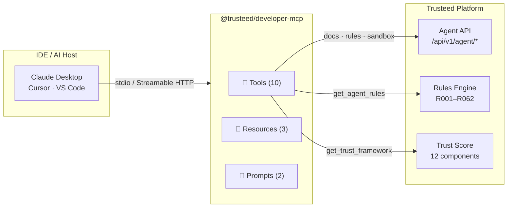
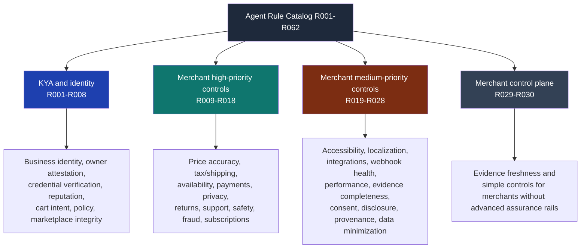
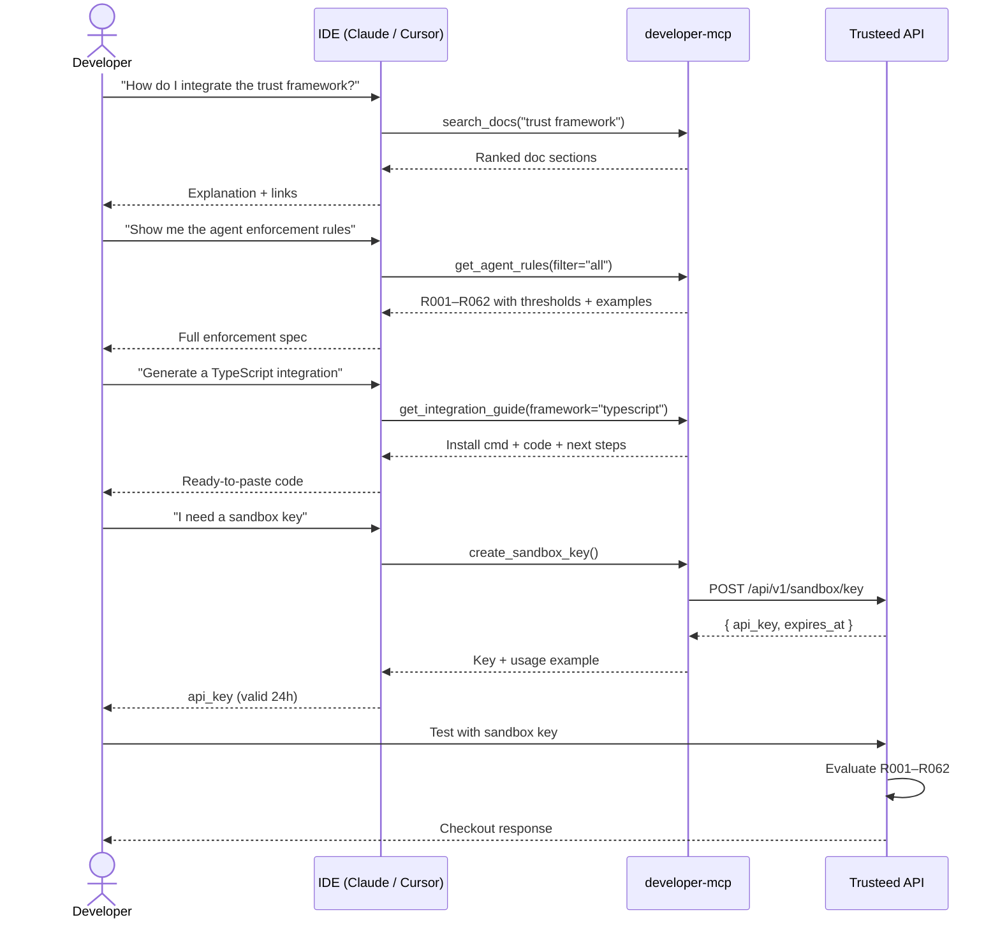

[**English**](README.md) | [Español](README.es.md) | [Français](README.fr.md) | [Deutsch](README.de.md)

# @trusteed/developer-mcp

**Integration assistant for the [Trusteed](https://www.trusteed.xyz) merchant-side agent policy, trust scoring, and checkout enforcement APIs.**

This is a public, read-only MCP server for **developer enablement**: it answers questions, returns the merchant agent rules (R001–R062), shows the OpenAPI fragments, generates integration code for the most common frameworks, and issues short-lived sandbox keys. It is intended to live alongside your IDE while you build against Trusteed.

It is **not** a checkout runtime. Production enforcement happens through the Trusteed API, the merchant plugins (Shopify, WooCommerce, PrestaShop, Odoo, Magento, Wix), and the signed RuleSnapshot fetched offline by those plugins. The decisions an LLM produces from this MCP's responses are documentation guidance, not authorisation.

Works with Claude Desktop, Cursor, VS Code, and any MCP-compatible host. No authentication required for documentation tools; `create_sandbox_key` is rate-limited per IP.

---

## When NOT to use this MCP

This server is intentionally narrow. Do **not** use it for:

- **Production authorisation decisions.** The `get_agent_rules` output describes how R001–R062 _work_; it does not _execute_ them. Call `POST /api/v1/rules/evaluate` (or fetch the signed RuleSnapshot for offline enforcement) for any real allow/block decision.
- **Storing or rotating secrets.** Never paste long-lived API keys, merchant credentials, or production tokens into prompts that reach this MCP. Sandbox keys returned by `create_sandbox_key` are designed to be disposable (24 h TTL); rate limits are enforced server-side.
- **Handling PCI, PII, or payment data.** The tools return documentation, schemas, and configuration metadata only. No PAN, PII, or order content flows through this server.
- **Compliance attestation.** LLM-generated explanations of the trust framework or rule semantics are not legally binding. Use the canonical sources (the [trust methodology page](https://www.trusteed.xyz/trust/methodology), the [agent-policy.json](https://www.trusteed.xyz/.well-known/agent-policy.json), the OpenAPI spec) for any compliance, audit, or legal review.
- **High-volume programmatic access.** HTTP mode is rate-limited (100 req / 15 min / IP). For bulk documentation ingest, mirror the OpenAPI and Markdown sources directly from the public site or repo.

If you need a server that _executes_ commerce actions on behalf of an agent (carts, checkouts, payments), that is a separate concern — Trusteed exposes those via the per-merchant MCP server documented at `trusteed.xyz/:storeSlug/mcp` and via the merchant plugins. This package will not grow into one.

---

## Quick start

### npx (one-time run)

```bash
npx @trusteed/developer-mcp
```

### Claude Desktop

Add to `~/Library/Application Support/Claude/claude_desktop_config.json`:

```json
{
  "mcpServers": {
    "trusteed": {
      "command": "npx",
      "args": ["-y", "@trusteed/developer-mcp"]
    }
  }
}
```

### Cursor / VS Code

Add to `.cursor/mcp.json` or `.vscode/mcp.json`:

```json
{
  "servers": {
    "trusteed": {
      "command": "npx",
      "args": ["-y", "@trusteed/developer-mcp"]
    }
  }
}
```

### HTTP mode (remote / multi-client)

```bash
npx @trusteed/developer-mcp --http --port=3100
# POST http://localhost:3100/mcp
# Rate limit: 100 req / 15 min per IP
```

---

## Architecture overview



---

## Tools

### `search_docs`

Search the Trusteed documentation by keyword. Returns ranked results from the trust framework, API reference, protocol specs, integration guides, and glossary.

| Parameter | Type         | Required | Description                                                                    |
| --------- | ------------ | -------- | ------------------------------------------------------------------------------ |
| `query`   | string       | ✅       | Search terms (e.g. `"trust score"`, `"x402 protocol"`)                         |
| `section` | enum         | —        | Filter: `api` · `trust` · `protocols` · `integration` · `glossary` · `general` |
| `limit`   | integer 1–20 | —        | Max results (default: 5)                                                       |

---

### `get_agent_rules`

Returns the 46 merchant agent rules (R001–R062) with tiers, configurable thresholds, trigger conditions, and examples. The primary reference for implementing the Trusteed enforcement model. These rules do not require eIDAS, QTSP, Visa Verifier, or payment-network-specific evidence unless a merchant explicitly configures such evidence elsewhere.

| Parameter | Type   | Required | Description                                                               |
| --------- | ------ | -------- | ------------------------------------------------------------------------- |
| `filter`  | enum   | —        | `all` · `tier1` · `tier2` · `needs_lookup` · `no_lookup` (default: `all`) |
| `code`    | string | —        | Single rule by code, e.g. `R007`. Overrides `filter`.                     |

---

### `get_trust_framework`

Returns the full merchant trust scoring methodology: 12 weighted components, the published ranking formula, merchant visibility states, and verification levels.

No parameters.

---

### `get_protocol_info`

Details on the three supported agentic payment protocols: ACP (Stripe/OpenAI), AP2 (Google), x402 (USDC stablecoin). Includes payment flow, security measures, and adapter identifiers.

| Parameter  | Type   | Required | Description                                                              |
| ---------- | ------ | -------- | ------------------------------------------------------------------------ |
| `protocol` | string | —        | `ACP` · `AP2` · `x402`. Omit for a side-by-side comparison of all three. |

---

### `get_openapi_schema`

Returns the OpenAPI 3.0 fragment for a specific Agent API endpoint.

| Parameter  | Type   | Required | Description                                                                                       |
| ---------- | ------ | -------- | ------------------------------------------------------------------------------------------------- |
| `resource` | string | ✅       | `search` · `products` · `compare` · `availability` · `cart` · `checkout` · `orders` · `merchants` |

---

### `get_integration_guide`

Step-by-step integration guide with working code for a specific framework.

| Parameter   | Type   | Required | Description                                                                    |
| ----------- | ------ | -------- | ------------------------------------------------------------------------------ |
| `framework` | string | ✅       | `typescript` · `python` · `langchain` · `vercel-ai` · `openai-agents` · `curl` |

---

### `create_sandbox_key`

Generates a temporary 24-hour API key for testing without registering. Rate limits are enforced server-side.

No parameters.

---

### `get_extension_manifest_schema`

Returns the Trusteed extension manifest schema: required fields, per-field constraints with developer-oriented notes, and the signing envelope (JWS Compact Ed25519, RFC 8785 canonicalization, developer + Trusteed countersignature). Documentation only — for runtime validation, use the `@trusteed/sdk-extension` linter or fetch the canonical schema URL.

No parameters.

---

### `get_webhook_event_schema`

Returns the Trusteed webhook delivery contract: envelope structure, HMAC-SHA256 canonical base string `v1.{ts}.{nonce}.{METHOD}.{path}.{sha256_hex(body)}`, retry schedule `[5s, 30s, 5min, 1h, 6h]` with DLQ at attempt 6, circuit-breaker semantics, and per-event payload summaries.

| Parameter    | Type   | Required | Description                                                                                                                                                                                                                                      |
| ------------ | ------ | -------- | ------------------------------------------------------------------------------------------------------------------------------------------------------------------------------------------------------------------------------------------------ |
| `event_type` | string | —        | Single event to detail. One of: `agent.first_seen`, `agent.identified`, `checkout.created`, `checkout.completed`, `checkout.cancelled`, `checkout.blocked`, `refund.issued`, `rule.triggered`. Omit for the full envelope + signature reference. |

---

### `get_extension_scopes`

Returns the catalog of `scopes_requested` enum values with data classification (public / operational / sensitive / PII), PII flag, minimum `risk_category` impact, an example use case, and an explicit "not for" anti-use case. Anchors the minimum-viable-scope principle: extensions touching `customers:read:pii` get manual review, high risk_category, and slower install conversion.

| Parameter | Type   | Required | Description                                                                                                                                                                                                                                                                                                                                                       |
| --------- | ------ | -------- | ----------------------------------------------------------------------------------------------------------------------------------------------------------------------------------------------------------------------------------------------------------------------------------------------------------------------------------------------------------------- |
| `scope`   | string | —        | Single scope name to focus on. One of: `events:subscribe:checkout`, `events:subscribe:rules`, `events:subscribe:refunds`, `events:subscribe:agents`, `agents:read`, `agents:read:reputation`, `checkouts:read`, `checkouts:read:pricing`, `customers:read:pii`, `rules:read`, `merchant_config:read:public`, `extension_config:write`. Omit for the full catalog. |

---

## Agent Control Points — R001–R062

These 46 rules constitute the **Trusteed merchant rule catalog**: a policy layer for agentic commerce, checkout risk, merchant controls, and customer protection. They are ordinary merchant/catalog rules. They do **not** require eIDAS, QTSP, Visa Verifier, or any regulated identity provider unless a merchant separately configures those higher-assurance integrations.


> **Catalogue coverage.** All **46** rules of the production engine (`R001`–`R062`,
> non-contiguous) are documented here as of `AGENT_RULES_VERSION` `2.0.0`. The
> `R031`–`R062` entries were derived from each evaluator in
> `rule-catalog.ts` — `when` mirrors the branch that actually returns HIT, and
> `defaults` lists only values the evaluator really falls back to. Caps with no
> default say so: those rules stay inert until the merchant configures them.

The public source of truth is the `get_agent_rules` MCP tool, which returns every rule with code, category, maturity, severity, evaluation phase, description, default action, evidence expectations, and examples.



### Rule summary table

For full descriptions, configurable parameters, cart attribute dependencies, and integration examples see **[docs/agent-rules-reference.md](docs/agent-rules-reference.md)**.

| Code  | Name                            | Function                                                               |
| ----- | ------------------------------- | ---------------------------------------------------------------------- |
| R001  | `verified-agent-required`       | Blocks checkout when no verified agent identity is present             |
| R002  | `signature-spoof-block`         | Blocks invalid or unverifiable agent token signatures                  |
| R003  | `mandate-boundary-match`        | Enforces operator mandate spending cap and category allowlist          |
| R004  | `new-key-friction`              | Adds friction when a freshly-issued agent key is used                  |
| R005  | `revoked-agent-block`           | Blocks revoked agents or those with repeated identity failures         |
| R006  | `provider-confidence-tier`      | Enforces minimum trust score and provider confidence                   |
| R007  | `cross-merchant-abuse-signal`   | Blocks agents flagged by 2+ merchants in the last 30 days             |
| R008  | `scope-escalation-detection`    | Blocks requests that exceed merchant-authorized agent scopes           |
| R009  | `agent-verification-required`   | Merchant-side mirror of R001 for catalog and session operations        |
| R010  | `new-agent-probation`           | Requires a minimum number of prior completed orders                    |
| R011  | `repeat-failed-checkout`        | Blocks agents exceeding failed checkout attempts in a time window      |
| R012  | `high-risk-category`            | Blocks orders containing merchant-defined high-risk product categories |
| R013  | `return-policy-guard`           | Blocks when agent return expectations conflict with merchant policy     |
| R014  | `delivery-risk-guard`           | Blocks high-risk delivery countries and repeat post-ship cancellers    |
| R015  | `price-change-guard`            | Blocks when cart price has shifted beyond an allowed delta             |
| R016  | `stock-confidence-guard`        | Blocks when line-item stock falls below the required minimum           |
| R017  | `coupon-discount-anomaly`       | Limits discount code attempts and maximum discount depth               |
| R018  | `cart-composition-guard`        | Detects order spikes, item count abuse, and single-SKU quantity abuse  |
| R019  | `country-jurisdiction`          | Restricts orders to allowed countries or blocks specific jurisdictions |
| R020  | `business-hours`                | Restricts agentic orders to merchant business hours in local timezone  |
| R021  | `first-purchase-with-merchant`  | Flags first-time agent purchases for review                            |
| R022  | `payment-rail-restriction`      | Enforces an allowlist or blocklist of payment methods                  |
| R023  | `refund-abuse-guard`            | Blocks agents with a high refund ratio in a rolling window             |
| R024  | `dispute-history-guard`         | Blocks agents with too many payment disputes recently                  |
| R025  | `sensitive-delivery-address`    | Blocks PO boxes and freight-forwarder addresses                        |
| R026  | `subscription-autorenew-guard`  | Requires explicit consent before processing auto-renew charges         |
| R027  | `gift-card-stored-value`        | Caps stored-value / gift-card purchase amounts per transaction         |
| R028  | `b2b-po-guard`                  | Requires purchase-order evidence for B2B orders                        |
| R029  | `merchant-preset`               | Applies one of four named risk presets (abierto/equilibrado/estricto/regulado) |
| R030  | `simple-controls`               | Amount cap and country restriction without advanced evidence rails     |

The internal Checkout Enforcement Layer also keeps legacy R001–R010 evaluators for existing merchants and plugin snapshots. New integrations should treat rule codes as opaque strings and use the current `get_agent_rules` output rather than hard-coding old names or assuming exactly ten rules.

---

### Configuring rules via the API

Pass a `merchantPolicies` object to the rules evaluation endpoint:

```bash
POST https://www.trusteed.xyz/api/v1/rules/evaluate
Content-Type: application/json
X-Agent-Api-Key: <your-key>

{
  "agentId": "agent_abc123",
  "agentTrustScore": 42,
  "orderContext": {
    "cartTotalCents": 8500,
    "billingCountry": "ES",
    "lineItems": [{ "productId": "p1", "quantity": 2 }],
    "paymentMethod": "stripe_card"
  },
  "merchantPolicies": {
    "r002": { "threshold": 40 },
    "r003": { "windowSeconds": 30, "maxAttempts": 3 },
    "r005": { "maxRatio": 0.3 },
    "r010": { "stripeRiskLevel": "elevated" }
  }
}
```

For **offline enforcement** (plugin-side, no network call), fetch the signed rules snapshot:

```bash
GET https://www.trusteed.xyz/:storeSlug/rules-snapshot
# Returns a JWS-signed RuleSnapshot valid for 5 minutes
```

---

## Developer workflow



---

## Resources

Resources are passive reference data readable by agents at any time.

| URI                     | MIME               | Description                                                                           |
| ----------------------- | ------------------ | ------------------------------------------------------------------------------------- |
| `docs://llms.txt`       | `text/plain`       | Platform manifest — endpoints, rate limits, trust score summary                       |
| `policy://agent-policy` | `application/json` | Agent action policies: trust score ranges, confirmation requirements, fail-safe rules |
| `spec://openapi`        | `application/json` | OpenAPI 3.0 spec summary for all Agent API endpoints                                  |

---

## Prompts

| Name                 | Description                 | Parameters                                   |
| -------------------- | --------------------------- | -------------------------------------------- |
| `integration_helper` | Guided integration workflow | `framework` (optional), `useCase` (optional) |
| `troubleshoot`       | Debug common API errors     | `error` (optional), `endpoint` (optional)    |

---

## Transport modes

| Mode              | Command                                          | Use case                                               |
| ----------------- | ------------------------------------------------ | ------------------------------------------------------ |
| `stdio` (default) | `npx @trusteed/developer-mcp`                    | Claude Desktop, Cursor, VS Code — one process per host |
| `HTTP`            | `npx @trusteed/developer-mcp --http --port=3100` | Remote deployment, multiple clients, CI pipelines      |

HTTP mode is stateless (one server per request). CORS is open (`*`). Rate limit: 100 requests / 15 minutes per IP.

---

## Links

- Platform: [trusteed.xyz](https://www.trusteed.xyz)
- Demo store — live rules playground: [trusteed.xyz/en/demo-store](https://www.trusteed.xyz/en/demo-store)
- Agent policy: [trusteed.xyz/.well-known/agent-policy.json](https://www.trusteed.xyz/.well-known/agent-policy.json)
- Agent playbooks: [trusteed.xyz/.well-known/agent-playbooks.json](https://www.trusteed.xyz/.well-known/agent-playbooks.json)
- MCP manifest: [trusteed.xyz/.well-known/mcp.json](https://www.trusteed.xyz/.well-known/mcp.json)

---

## Acknowledgements

This MCP server exposes integrations built on top of the following external protocols and platforms. These are infrastructure dependencies, not formal collaborators, but they make the agentic commerce layer possible.

| Partner | Role | Integration |
| ------- | ---- | ----------- |
| [Stripe](https://stripe.com) | Fiat payment infrastructure | ACP protocol (OpenAI/Stripe checkout sessions); R011 repeat-failed-checkout uses Stripe Radar risk signals when the payment method is Stripe |
| [OpenAI](https://openai.com) | ACP protocol co-author | Agentic Commerce Protocol (ACP) for agent-mediated fiat payments |
| [Google](https://developers.google.com) | AP2 protocol | Agent Payment Protocol v2 — Google Cart Mandate for agent-mediated payments |
| [Coinbase](https://www.coinbase.com/developer-platform) | x402 stablecoin rail | USDC payment infrastructure for the x402 protocol |
| [Cloudflare](https://cloudflare.com) | x402 co-author | x402 open standard for HTTP-native stablecoin payments |
| [Anthropic / MCP](https://modelcontextprotocol.io) | Transport protocol | Model Context Protocol SDK (`@modelcontextprotocol/sdk`) |

**Higher-assurance integrations** (available in the Trusteed platform for merchants who opt in, not required by default):

| Partner | Role |
| ------- | ---- |
| [HUMAN Security](https://www.humansecurity.com) | Agent identity verification via AgenticTrust — RFC 9421 HTTP Message Signatures for buyer agents |
| Visa (TAP) | Trusted Agent Protocol — `agent-browser-auth` / `agent-payer-auth` signature tags for Visa-verified agents |
| [InfoCert (QTSP)](https://infocert.eu) | eIDAS-qualified electronic signatures and timestamps for trust receipts |

These higher-assurance integrations are gated by merchant configuration and are not invoked by this documentation MCP server. See the platform trust methodology for details.

---

## License

MIT
